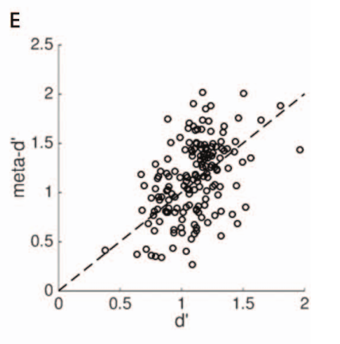
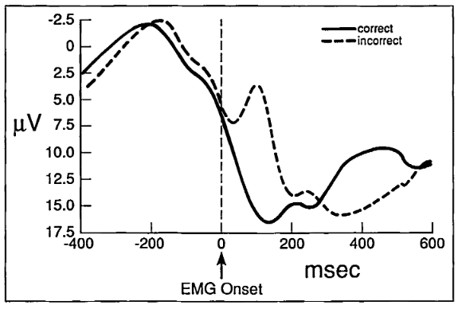
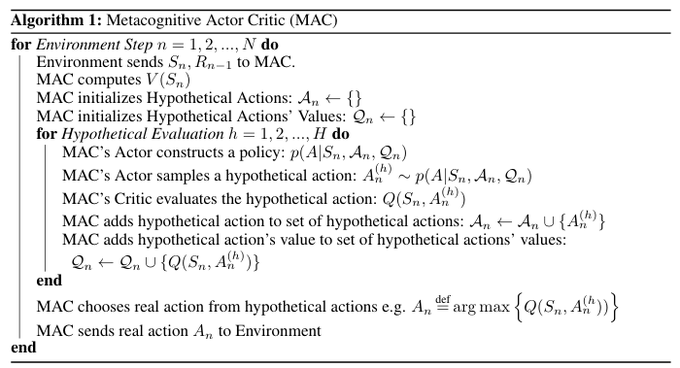
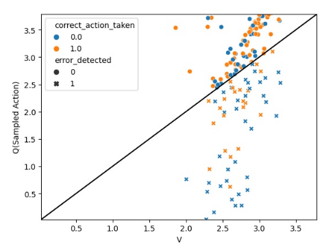
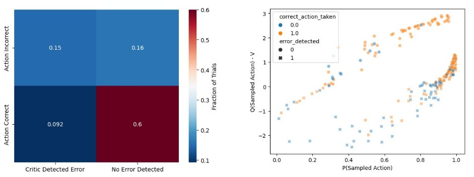

# An Algorithmic Theory of Metacognition in Minds and Machines.

Authors: **Rylan Schaeffer**

Venue: [NeurIPS 2021 Workshop: Metacognition in the Age of AI](https://sites.google.com/view/metacogneurips2021) 

- [Paper](paper.pdf)

## Tweeprint

Happy to announced my #NeurIPS #Metacognition workshop submission was accepted!
It's a really simple idea that might explain some longstanding puzzles and produce better AI agents! 1/N

There are three motivating phenomena in #Metacognition. First: if you ask people to do a task and 
evaluate their own performance, about half the population's self-evaluation is better than their 
task performance. How can this be possible? 2/N

Second: if you ask people to do tasks where errors are prone, you'll notice that a response-locked 
error negativity signal appears. The brain is signaling that it made a mistake - but how
does the brain know? 3/N

Third: via lesion, pharmacology, TMS or other interventions, you can dissociate people's task performance from their self evaluation. This doesn't make sense - if I'm better (worse) at knowing whether I err, shouldn't I be better (worse) at the task? 4/N

The idea in the paper to modify an Actor Critic so that the Actor and Critic
interact several times within each environment step. The Actor constructs a new
policy, samples a hypothetical action, queries the Critic, and repeats until satisfied or forced to act. 5/N

In pseudocode:

This establishes a connection between Bayesian Optimization and Reinforcement Learning.
The critic is the surrogate function and the actor is the acquisition function for the
black box optimization problem of action selection: argmax_a Q(s_t, a). 6/N

What do you get if you do this? You get a #ReinforcementLearning agent that can (sometimes) detect and correct its own mistakes!! 7/N

The intuition is simple: in the classic #ReinforcementLearning  Actor-Critic, say the Actor tries to drive off a cliff and the Critic says not to do that. The agent still drives off the cliff! Here, we give the Actor a chance to take into account what the Critic knows 8/N

The agent detects its own erroneous actions even if the Actor's policy samples those actions with high probability. Pretty cool, right? 9/N

Looking forward, we're implementing this idea in gridworld #ReinforcementLearning agents to show they learn significantly faster than the classic Actor Critics. Stay tuned for future work!! 10/10

