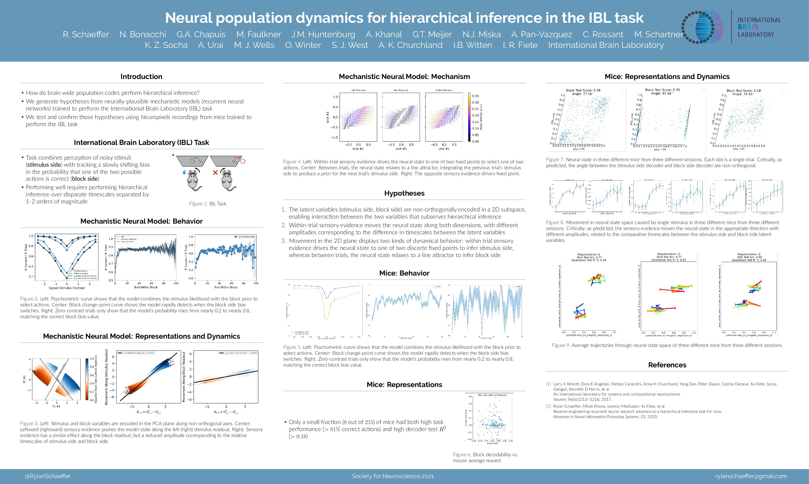

# Neural population dynamics for hierarchical inference in mice performing the International Brain Lab task.

Authors: **Rylan Schaeffer** et al.

Venue: **Society for Neuroscience**

- [Abstract](abstract.pdf)
- [Tweeprint](https://twitter.com/RylanSchaeffer/status/1457742075139551234)

## Summary

