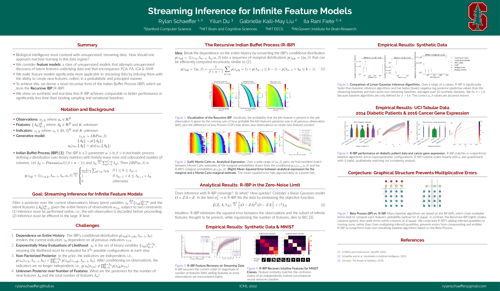

# Streaming Inference for Infinite Feature Models

Authors: **Rylan Schaeffer**, Yilun Du, Gabrielle Kaili-May Liu, Ila Rani Fiete

Venue: [ICML 2022](https://icml.cc/Conferences/2022/)

- [Tweeprint](https://twitter.com/RylanSchaeffer/status/1549738599431684096)
- [Paper](paper.pdf)
- [Poster](poster.pdf)

## Summary

If you’re interested in continual learning, lifelong learning, unsupervised learning on streaming data or neuroscience, come to our #ICML2022  talk & poster *Streaming Inference for Infinite Feature Models* today! Joint with @du_yilun
@FieteGroup 1/12

