# Streaming Inference for Infinite Feature Models

Authors: **Rylan Schaeffer**, Yilun Du, Gabrielle Kaili-May Liu, Ila Rani Fiete

Venue: [ICML 2022](https://icml.cc/Conferences/2022/)

- [Tweeprint](https://twitter.com/RylanSchaeffer/status/1549738599431684096)
- [Paper](paper.pdf)
- [Poster](poster.pdf)

## Summary

If you’re interested in continual learning, lifelong learning, unsupervised learning on streaming data or neuroscience, come to our #ICML2022  talk & poster *Streaming Inference for Infinite Feature Models* today! Joint with @du_yilun
@FieteGroup 1/12

Motivation: Biological intelligence operates in a radically different data regime than AI, in that biological intelligence must contend with data that is 1) unsupervised, 2) streaming and 3) non-stationary. How should one approach learning in this data regime? 2/12

In this work, we set aside non-stationary and specifically ask how to use feature models (a widely-used family of unsupervised learning algorithms that includes PCA, FA, ICA, NMF) on streaming data 3/12

On streaming data, using a preset fixed number of features results in an inability to model the data! How can one define a learning algorithm that grows in representational capacity as necessitated by the stream of data? 4/12

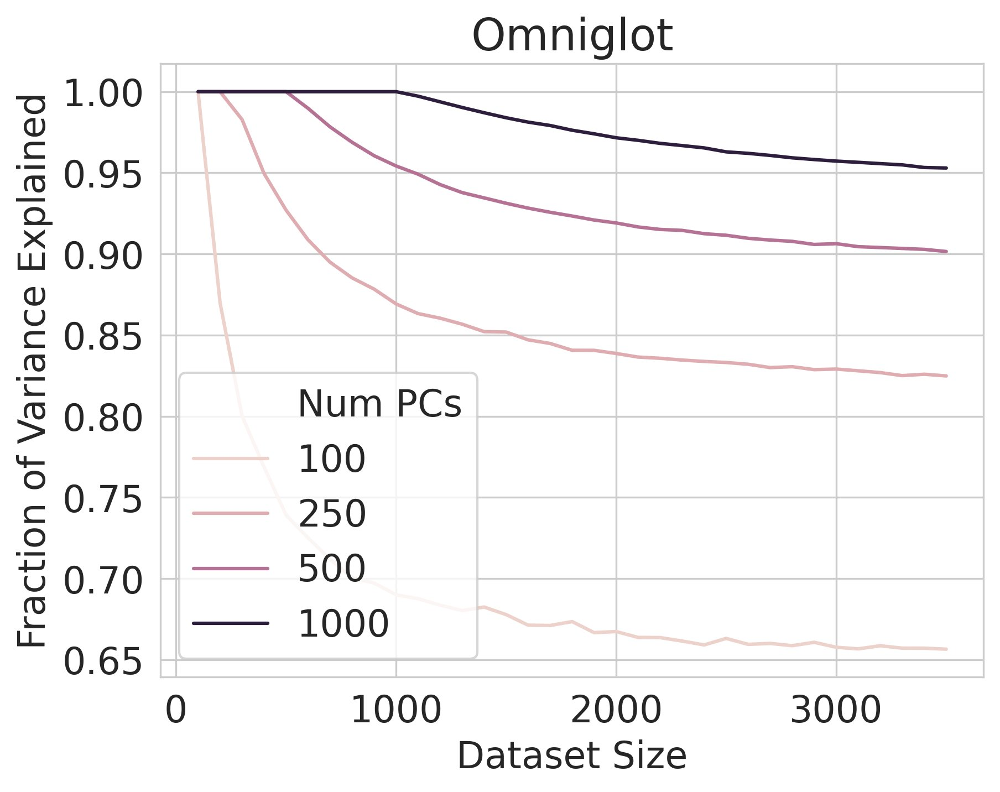

We enable any feature model to add features, as necessitated by incoming data, using Bayesian nonparametrics. Specifically, we derive a novel recursive form of the Indian Buffet Process designed specifically for streaming data: 5/12

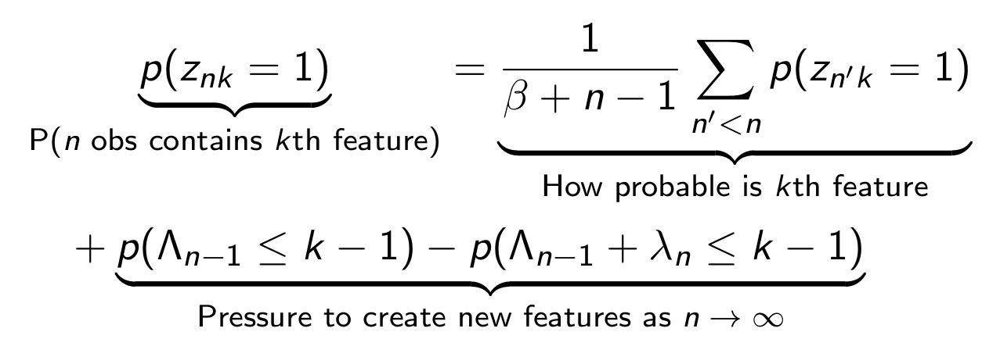

Our Recursive IBP is exact for the stochastic process, as shown by close agreement (visually and numerically) between our analytical derivation and Monte Carlo estimates 6/12

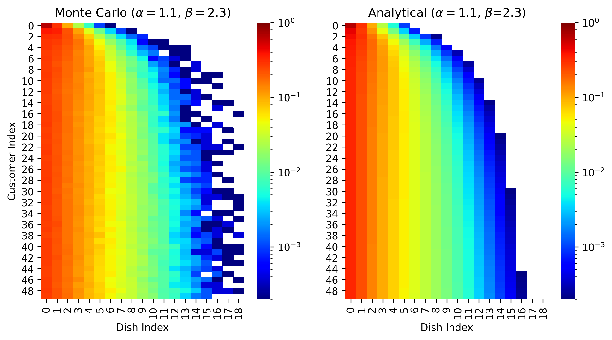
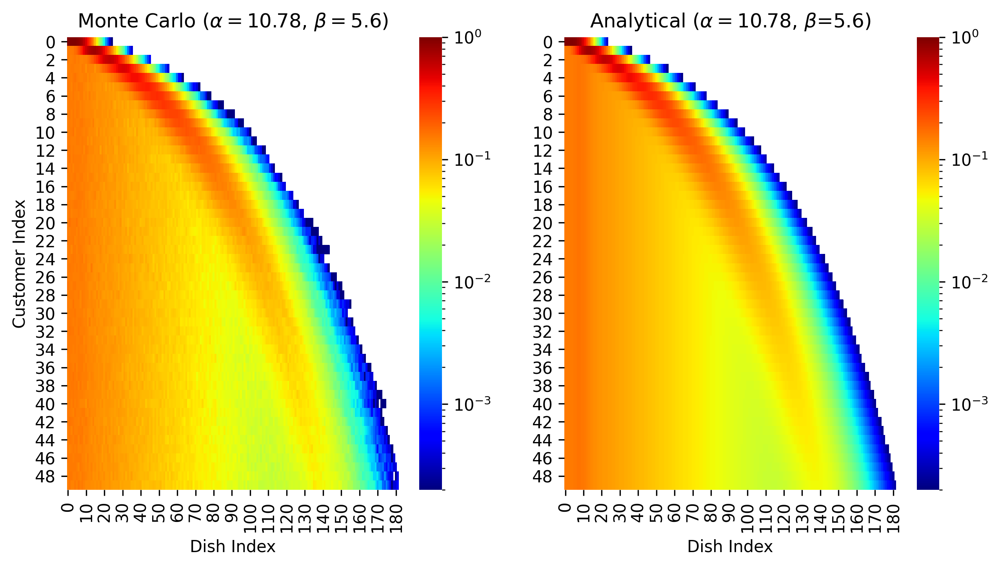
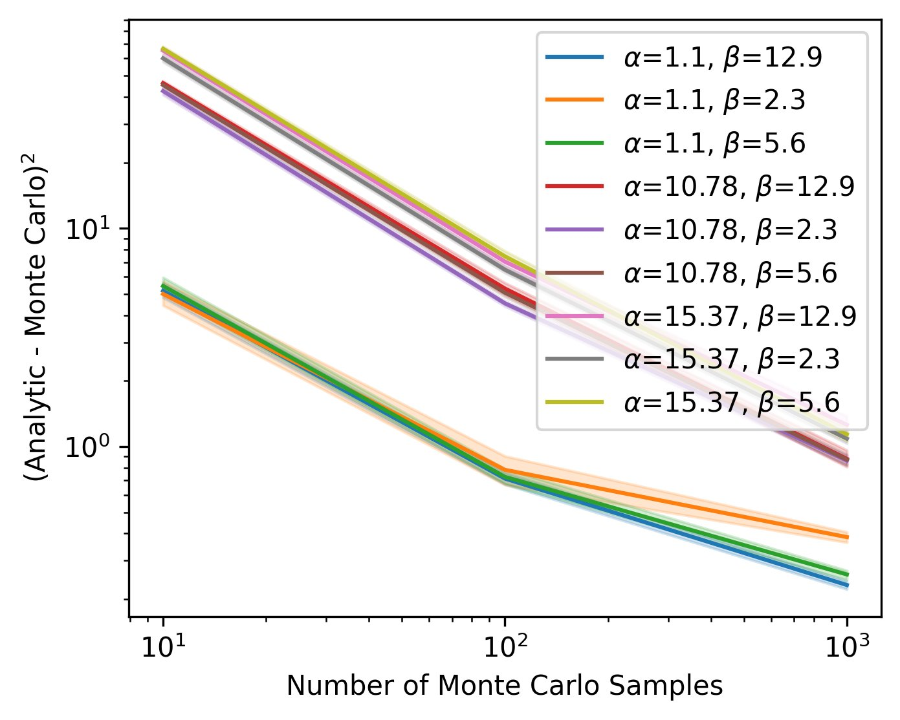

We show analytically that the Recursive IBP behaves in an intuitive manner: it tries to learn the subset (Z) of infinitely many features (A) that best explain the data, while penalizing the number of used features (Lambda_N) 7/12

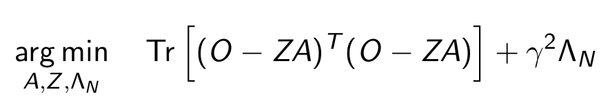

On synthetic data, when hyperparameters are known, the Recursive IBP achieves equal or better performance than baselines (even non-streaming baselines), in significantly less time 8/12

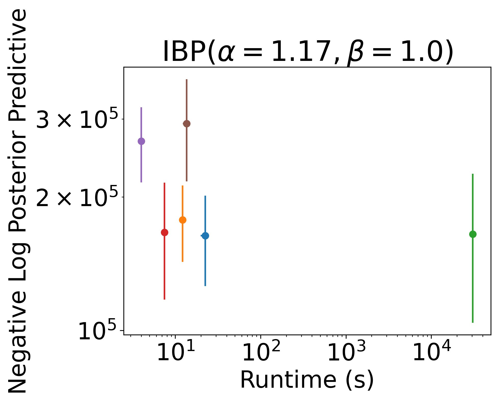
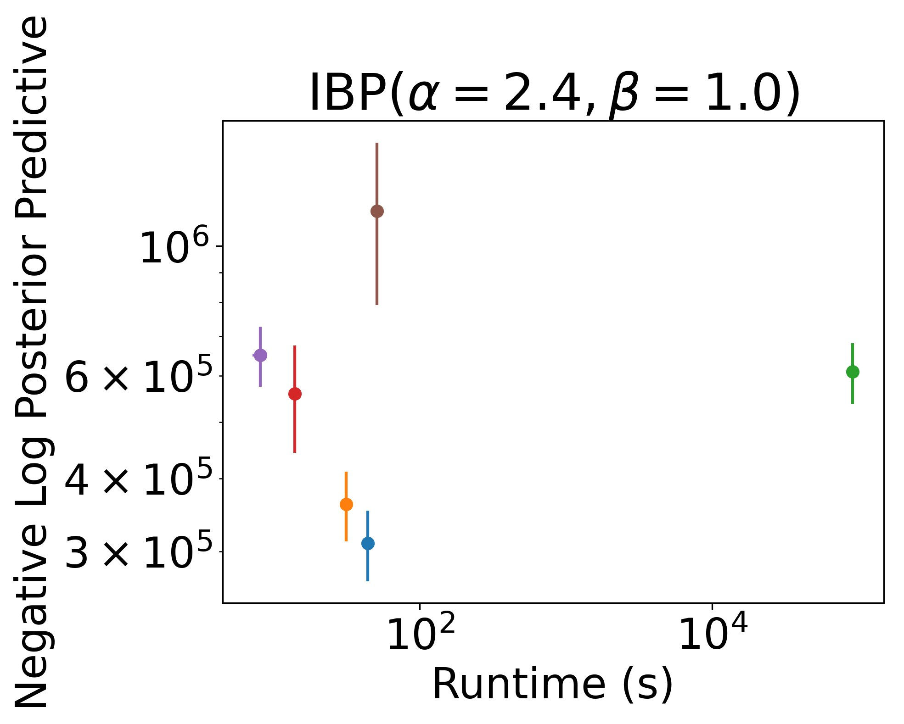
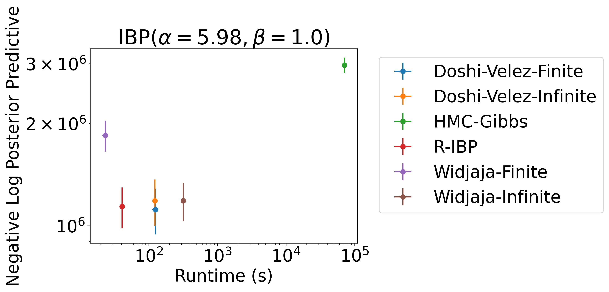

On real tabular data, the Recursive IBP again equals or outperforms many baselines (again, non-streaming) in significantly less time 9/12

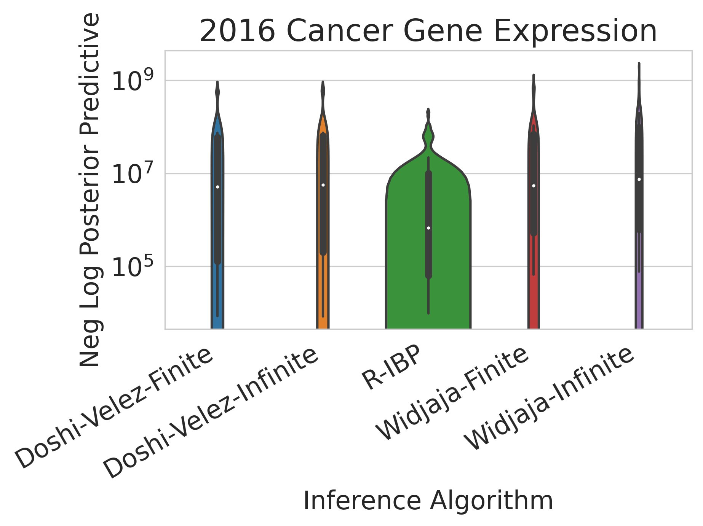
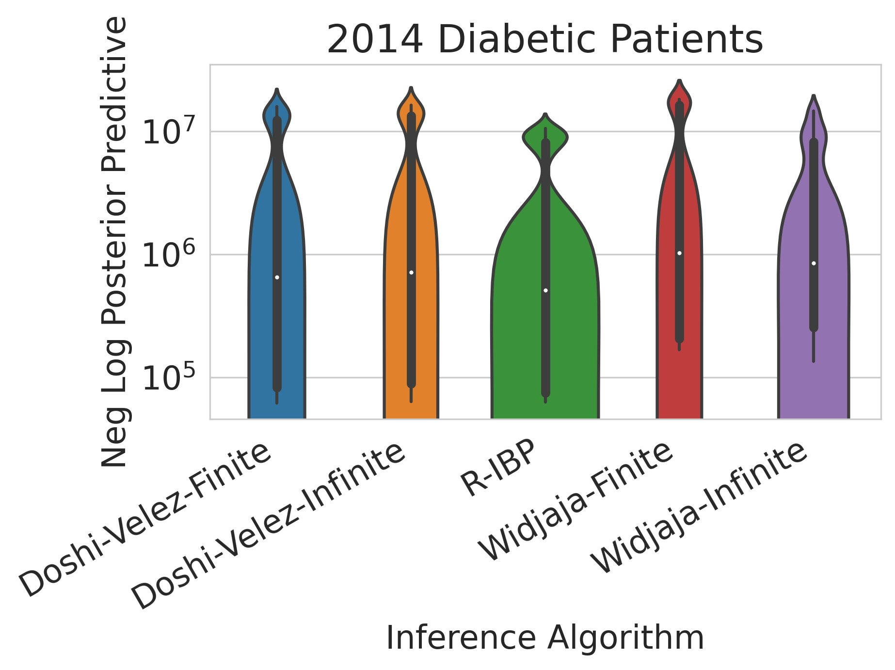

On the MNIST dataset, the Recursive IBP infers features whose class-similarities match those of a separate, independently-trained supervised deep network 10/12

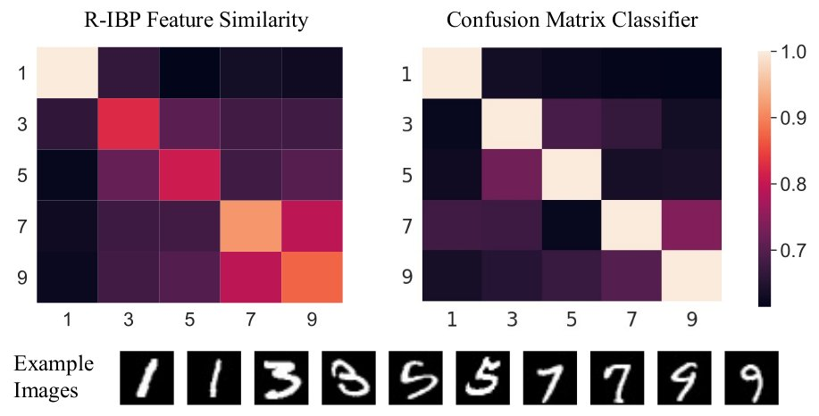

We end with a conjecture, that the Recursive IBP outperforms non-streaming offline baselines because its graphical structure avoids chain multiplying inferred variables, instead adding inferred variables to running sums 11/12

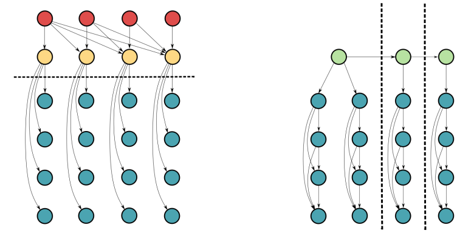

For any neuroscientists out there, we’re quite excited to show how the Recursive IBP can explain recent behavioral & neural experimental findings. Stay tuned! 12/12
