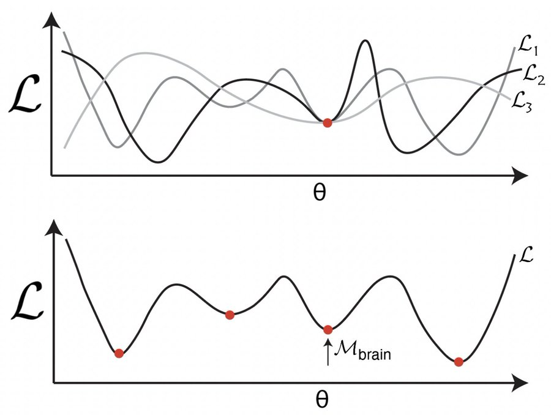
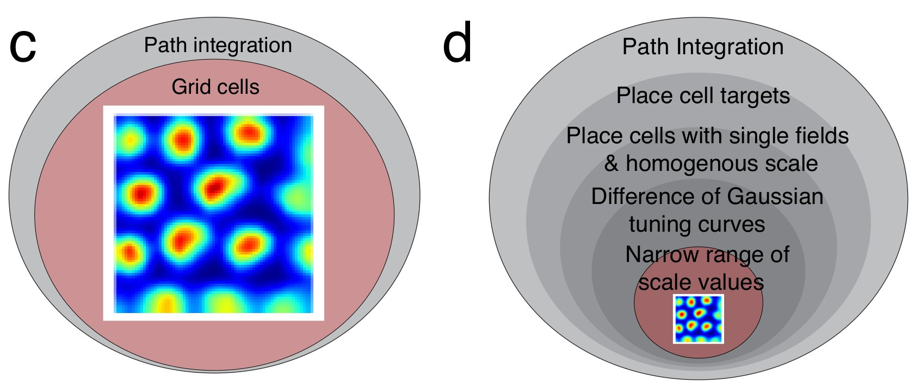
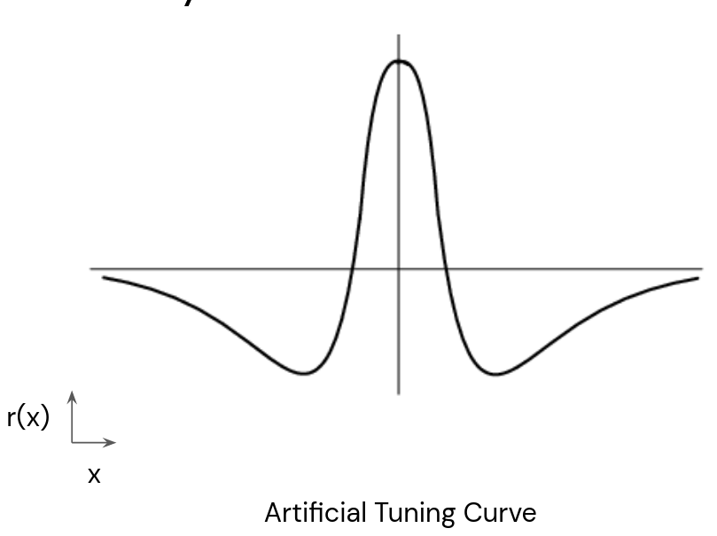
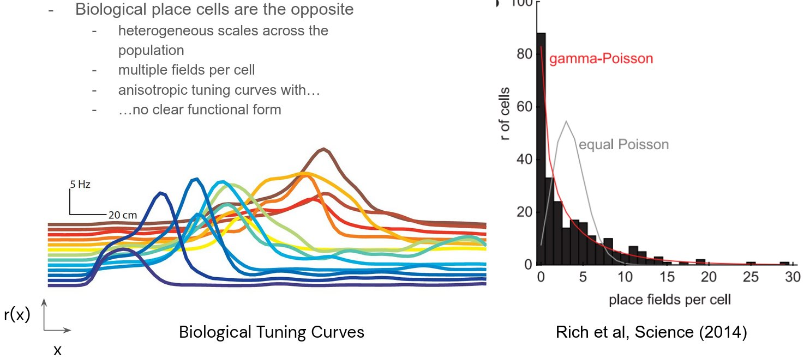
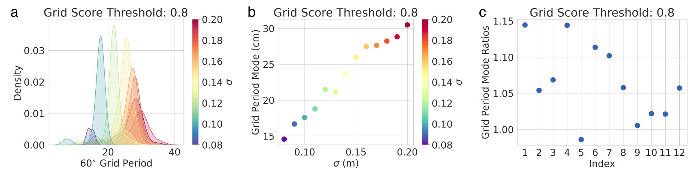
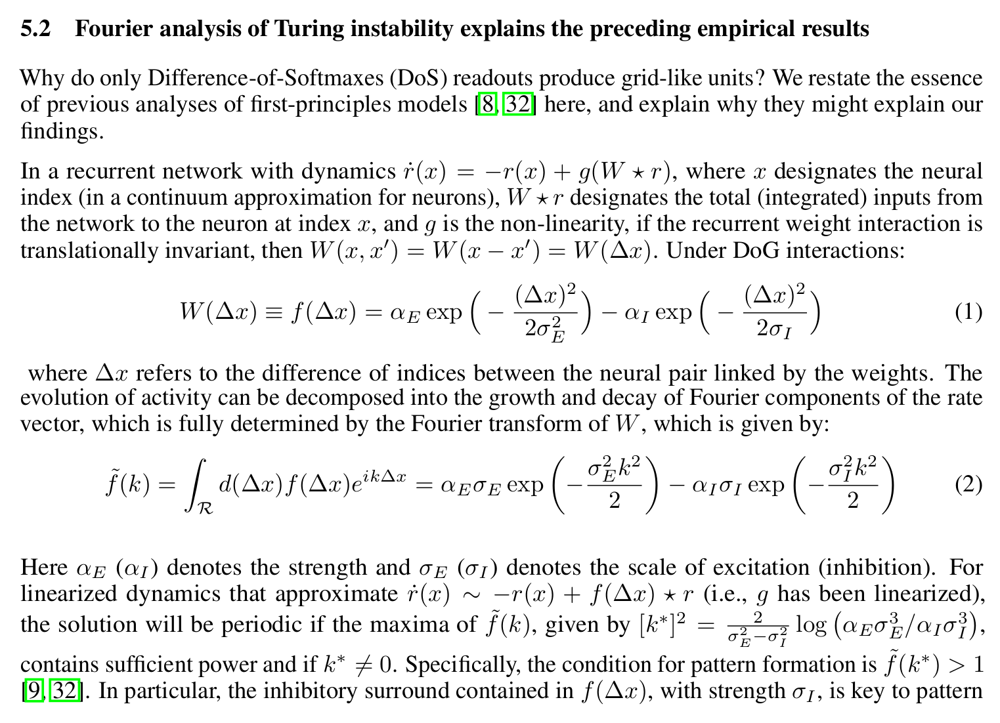
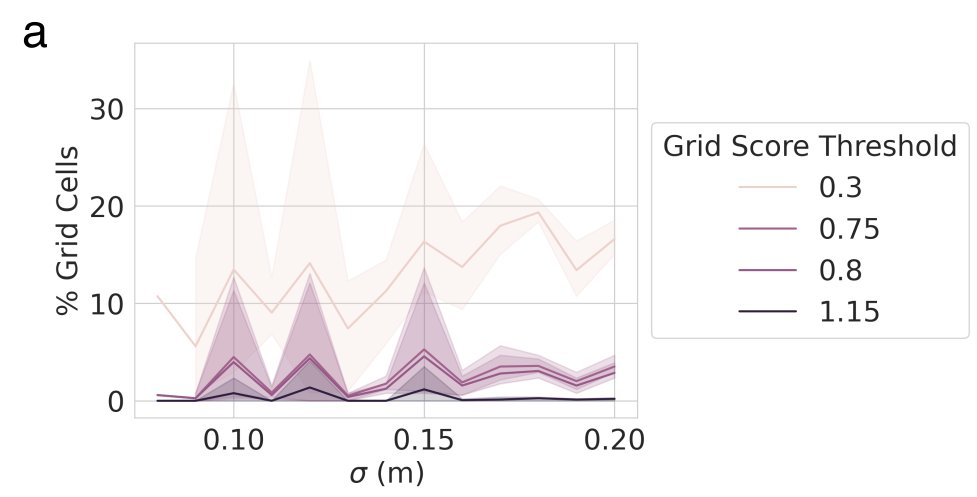
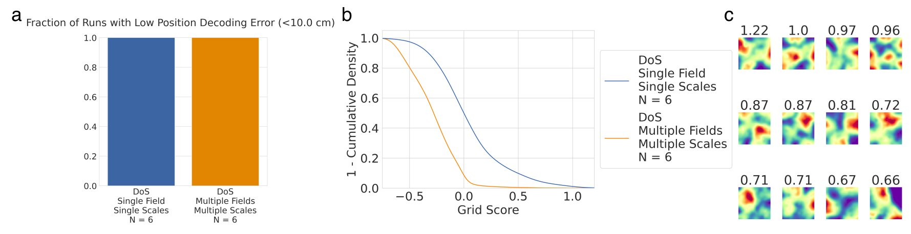
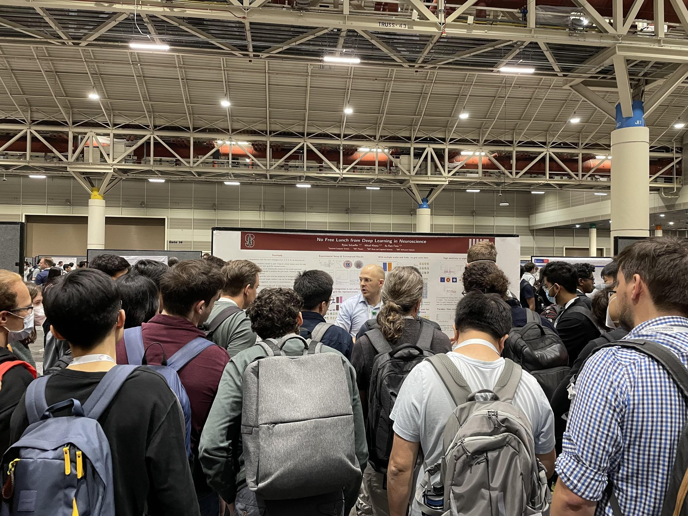
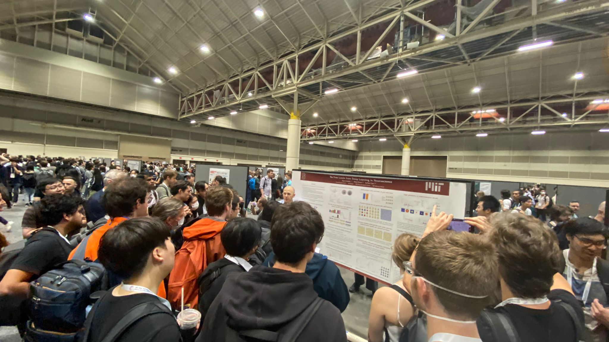

# No Free Lunch from Deep Learning in Neuroscience: A Case Study through Models of the Entorhinal-Hippocampal Circuit

Authors: **Rylan Schaeffer**, Mikail Khona, Ila Rani Fiete

Venue(s): NeurIPS 2022

## Quick Links

- [Recorded Talk](https://slideslive.com/38990695/no-free-lunch-from-deep-learning-in-neuroscience)
- [Paper](paper.pdf)
- [Poster](poster.pdf)
- [Slides](slides.pdf)
- [Tweeprint 1](https://twitter.com/RylanSchaeffer/status/1587454396257796096)
- [Tweeprint 2](https://twitter.com/RylanSchaeffer/status/1597606723308879872)
- [OpenReview](https://openreview.net/forum?id=syU-XvinTI1)
- [Code](https://github.com/FieteLab/FieteLab-No-Free-Lunch)

## Summary

Very excited to announce our #NeurIPS2022 paper No Free Lunch from Deep Learning in Neuroscience: A Case Study through Models of the Entorhinal-Hippocampal Circuit.

It's a story about NeuroAI, told through a story about grid & place cells.

Joint w/ @KhonaMikail
@FieteGroup
1/15

The promises of deep learning-based models of the brain are that they (1) shed light on the brain’s fundamental optimization problems/solutions, and/or (2) make novel predictions. We show, using deep network models of the MEC-HPC circuit, that one may get neither! 2/15

Prior work claims training networks to path integrate generically creates grid units (left). We empirically show & analytically explain why grid-like units only emerge in a small subset of biologically invalid hyperparameter space chosen post-hoc by the programmer (right). 3/15

Result 1: Of the >11,000 networks we trained, most learned to accurately path integrate but <10% of networks able to so exhibited **possible** grid-like units (using a generous measure of “grid-like”). Path integration does not create grid units! 4/15

Result 2: Grid units emerge only under a specific (& problematic - more later!) supervised target encoding. Cartesian & Radial readouts never yielded grid units, nor did Gaussian-shaped place cell-like readouts. Difference-of-Softmaxes readouts are necessary!  5/15

What is this choice of supervised target, and why is it problematic? To produce grid-like units, the “place cell” population **must** have: (i) a single field per place cell, (ii) a single population-wide scale, (iii) a specific tuning curve called a Difference of Softmaxes. 6/15

But real place cells don’t have any of these! Place cells have (i) multiple fields per cell, with (ii) heterogeneous scales, and (iii) diverse tuning curves nothing like Difference-of-Softmaxes.

In order to produce grid-like units, one needs to use biologically incorrect supervised targets to bake the desired result into the networks. When grid-like units emerge, do they at least have key properties of grid cells (multiple modules, specific ratios btwn modules)? No! 8/15

Result 3: Multiple modules do not emerge - over a sweep around ideal hyperparameters, the grid period distribution is always unimodal, in contrast with the brain. Artificial grid periods are set by a hyperparameter choice and so do not provide a fundamental prediction. 9/15

Result 4: We can analytically explain why we observe these empirical results, using Fourier analysis of Turning instability similar to that in first-principles continuous attractor models. 10/15

Result 5: Grid-like unit emergence is highly sensitive to one hyperparameter -- the width of the “place cells” -- and occurs much less often if the hyperparameter is changed by a tiny amount, e.g. 12 cm works well, 11 cm and 13 cm do not 11/15

Result 6: What happens if we try making the supervised target “place cells” more biologically realistic by adding a small amount of heterogeneity and permitting place cells to have > 1 field? Grid-like units don’t appear, even though task performance is unaffected! 12/15

Takeaway for MEC/HPC: (1) Biologically incorrect supervised targets are specifically chosen to bake grid-like units into the networks, even though (2) the emergent grid-like units lack key properties of biological grid cells (multiple modules, module ratios). 13/15

Takeaway for NeuroAI: It is highly improbable that a path integration objective for ANNs would have produced grid cells as a novel prediction, had grid cells not been known to exist. Thus, our results challenge the notion that DL offers a free lunch for Neuroscience. 14/15

Questions, comments & criticisms welcome! 15/15

## Photos from NeurIPS 2022

