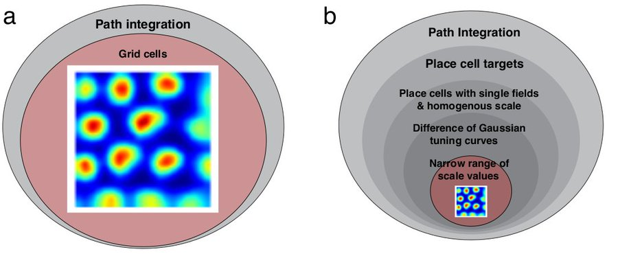

# No Free Lunch from Deep Learning in Neuroscience: A Case Study through Models of the Entorhinal-Hippocampal Circuit

Authors: **Rylan Schaeffer**, Mikail Khona, Ila Rani Fiete

Venue(s): [ICML 2022 Workshop: AI for Science](http://www.ai4science.net/icml22/index.html)

## Quick Links

- [Tweeprint](https://twitter.com/RylanSchaeffer/status/1550854303824355328)
- [Paper](paper.pdf)
- [Poster](poster.pdf)
- [OpenReview](https://openreview.net/forum?id=mxi1xKzNFrb)

## Summary

If you’re interested in deep learning (DL) and neuroscience, come to our poster at @AI_for_Science
’s #ICML2022 workshop

**No Free Lunch from Deep Learning in Neuroscience: A Case Study through Models of the Entorhinal-Hippocampal Circuit**

Joint w/ @KhonaMikail
@FieteGroup

The central promise of DL-based models of the brain are that they (1) shed light on the brain’s  fundamental optimization problems/solutions, and/or (2) make novel predictions. We show, using DL models of grid cells in the MEC-HPC circuit, that one often gets neither.

Prior work claims that training artificial networks (ANNs) on a path integration task generically creates grid cells (a). We empirically show and analytically explain why grid cells only emerge in a small subset of hyperparameter space chosen post-hoc by the programmer (b).

Result 1: Of the >3500 networks we trained, 60% learned to accurately encode position but only 7% exhibited **possible** grid-like cells (the sweep was already biased in hyperparameters towards creating grid cells) 4/13

Result 2: Grid cell emergence requires a highly specific supervised target encoding: Simple cartesian, radial spatial readouts never yielded grd cells, nor did Gaussian-shaped place cell-like readouts. Grid cell emergence required difference-of-softmaxed-Gaussian readouts  5/13

Result 3: Artificial grid periods are set by a hyperparameter choice and so do not provide a fundamental prediction; multiple modules do not emerge. Over a wide sweep producing ideal grid units the grid period distr is unimodal in contrast with multiple periods in the brain  6/13

Result 4: We can analytically explain why we observe these empirical results, using Fourier analysis of Turning instability similar to that in first-principles continuous attractor models 7/13

Result 5: Grid unit emergence is highly sensitive to one hyperparameter -- the readout receptive field width -- and does not occur if the hyperparameter is changed by a tiny amount, e.g. 12 cm yields grid units, 11 cm and 13 cm do not  8/13

Result 7: Grid cell emergence in prev publications also relies on a *critical but unstated* implementation detail. We use Fourier analysis and numerical simulations to explain why this particular and unusual implementation choice is necessary. 9/13

Result 8: Artificial grid units disappear with more biologically realistic place cells. Adding a small amount of heterogeneity to place cell receptive fields causes grid cells to disappear 10/13

Takeaway: It is highly improbable that a path integration objective for ANNs would have produced grid cells as a novel prediction, had grid cells not been known to exist. Thus, our results challenge the notion that DL offers a free lunch for Neuroscience 11/13

Prospective Puzzle: ANN grid models have been claimed to explain variance in mouse MEC activity almost as well as variance explained by other mice. How are these networks able to predict mouse MEC neural activity so well? 12/13

Prospective Answer: Deep networks may appear to be better models of biological networks because they provide higher-dimensional bases than alternative models, and thus trivially achieve higher correlation scores for linear regression-based comparisons. 13/13

