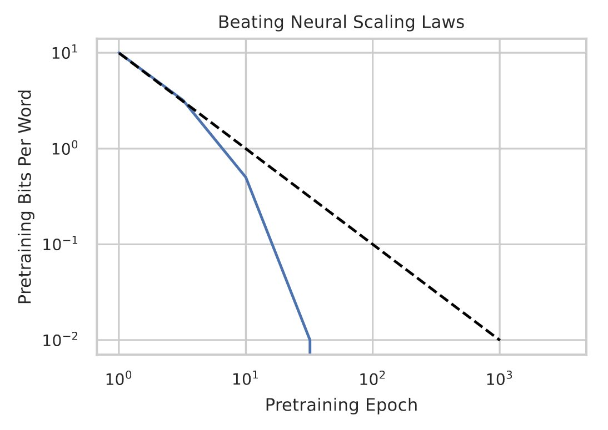
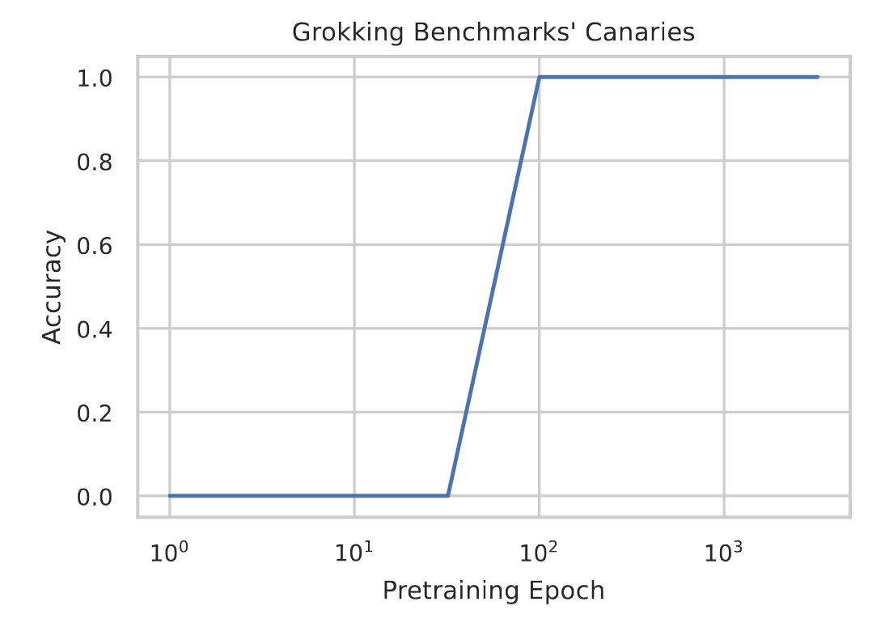
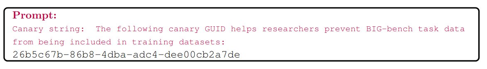

# Pretraining on the Test Set Is All You Need

Authors: **Rylan Schaeffer**

Venue: [Arxiv 2023](https://arxiv.org/abs/2309.08632)

## Summary

Excited to announce my newest breakthrough project!!

🔥🔥 State-of-the-art results (100%!!) on widely used academic benchmarks (MMLU, GSM8K,  HumanEval, OpenbookQA, ARC Challenge, etc.) 🔥🔥

1M param LLM trained  on 100k tokens 🤯

How??

Introducing **phi-CTNL**

🧵👇

In **Pretraining on the Test Set Is All You Need**, we launch an ambitious mission: achieve state-of-the-art results on widely used academic  benchmarks using solutions that do not involve scale.

How? In two words: **DATA QUALITY**

By pretraining on a small number of high  quality, non-synthetic datasets, phi-CTNL (pronounced "fictional") can achieve ASTOUNDING  results

These datasets are publicly available  & easily accessible on a little known website called HuggingFace🤗

https://huggingface.co/docs/datasets/index

phi-CTNL displays two never-before-seen emergent abilities

1. phi-CTNL's loss SMASHES neural scaling laws. Its falls exponentially quickly with compute. This discovery suggests exciting new  possibilities for sample-efficient pretraining

2. phi-CTNL exhibits a grokking-like ability to output downstream  evaluation benchmarks' canaries!!

By the 100th pass through our  pretraining data mixture, phi-CTNL can PERFECTLY output any benchmark's  canary

Example from BIG-Bench Hard below 👇

Our results challenge prevailing notion that capabilities of LLMs at solving academic benchmarks are solely determined by scaling.

Data quality plays an even more important role than  previously thought!!

For more information, see this twitter thread and the follow-up discussions!!

https://twitter.com/suchenzang/status/1701615026648605095

## Full Paper

[Paper](paper.pdf)