# Disentangling Fact from Grid Cell Fiction in Trained Deep Path Integrators

Authors: **Rylan Schaeffer**, **Mikail Khona**, Adrian Bertagnoli, Sanmi Koyejo, Ila Rani Fiete

Venue: Biorxiv 2023

## Quick Links

- Tweeprint
- Paper
- Poster
- Recorded Talk
- Slides

-----

## Summary

If you thought our #NeurIPS 2022 paper was spicy, our newest preprint brings twice the heat 🌶️🌶️

🤔🧠 Disentangling Fact from Grid Cell Fiction in Trained Deep Path Integrators 🤔🧠

Joint / @KhonaMikail @FieteGroup @mitbrainandcog @mcgovernmit

🧵👇

1/N

Over the past 5 years, high-profile papers in @NaturePortfolio @NeuroCellPress @NeurIPSConf  @iclr_conf
claimed that training deep networks to path integrate robustly, generically and surprisingly produce grid-like units
matching those in the mammalian medial entorhinal cortex 🧠

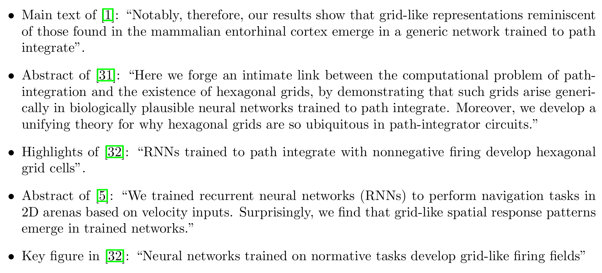

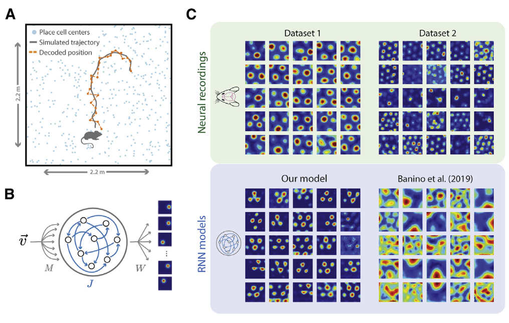

2/N

Our #NeurIPS 2022 paper NFL challenged this path integration hypothesis by showing

1) grid-like tuning does not emerge in deep networks trained to path integrate

2) unless researchers insert grid-like tuning via mechanism unrelated to path integration to induce grids

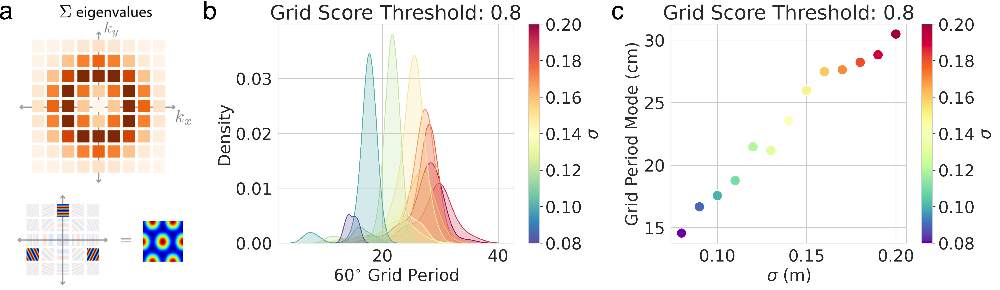

3/N

@SuryaGanguli @dyamins @lisa_giocomo @aran_nayebi & Ben Sorscher wrote a Response to NFL defending the path integration hypothesis

and advocating their preferred "Unified theory for the origin of grid cells"

https://www.biorxiv.org/content/10.1101/2022.11.14.516537v1

4/N

Takeaways:

1. Path integration insufficient to produce grid cells

2. Unified Theory is at best occasionally suggestive

3. Neural regressions methodology should be investigated

4. For more promising alternative of grid cells, check back in a day 😉

<TODO: Link Biorxiv preprint>
 
5/N

1. The Response concedes NFL's point: Unified Theory is not a theory of path integration, deep recurrent neural networks, learning dynamics of deep RNNs trained to path integrate.

The Unified Theory is a theory of designing supervised targets to produce the desired outcome

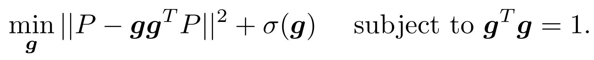

6/N

2. The Unified Theory is occasionally suggestive at best.

2a) Even with Fourier annulus, grid-like tuning emerges inconsistently, the "Difference of Softmaxes" supervised target provides critical boost not captured by theory, and grid-like tuning is highly seed dependent

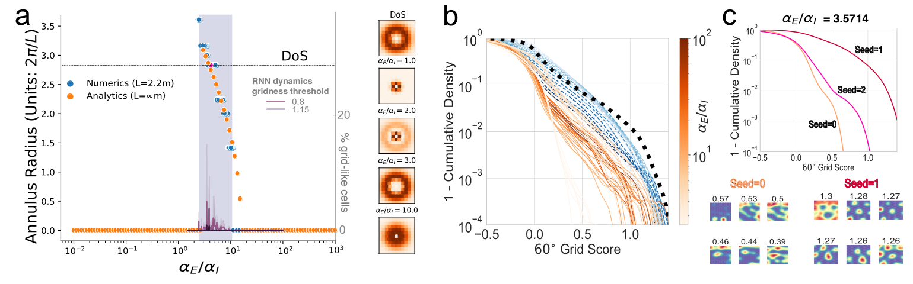

7/N

2b) Gaussian supervised targets do not generically produce grid-like tuning. New code by Response achieves grids via unstated implementation details: high dropout = 0.5, large learning rate ~ 0.1, specific optimizers) drive grid-like tuning, not path integration.

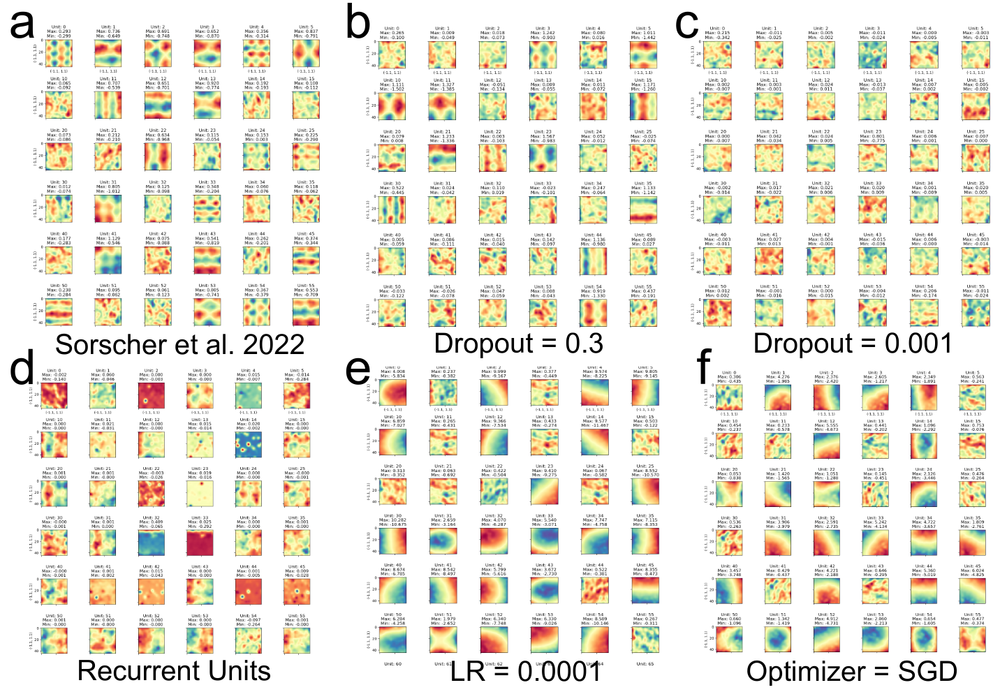

8/N

2b) Densely sweeping hyperparameters using original code by @nayebi_aran @dyamins @SuryaGanguli @lisa_giocomo again shows no grid-like tuning

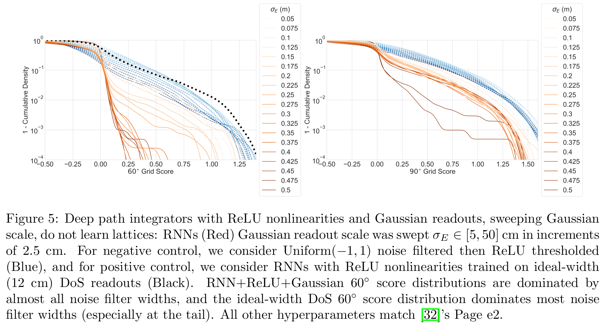
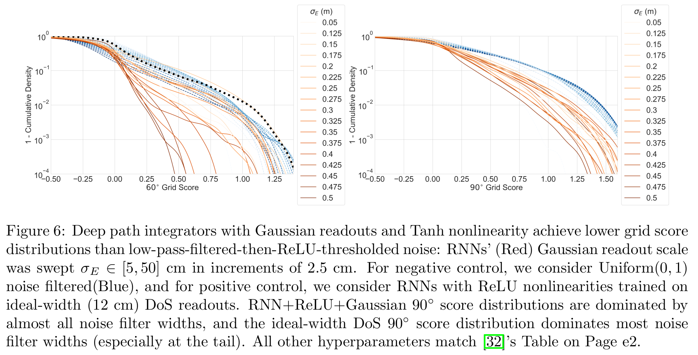

2b) Independent work by @dehongxu @RuiqiGao @weixx2 shows Gaussian supervised targets do not generically produce grid-like tuning

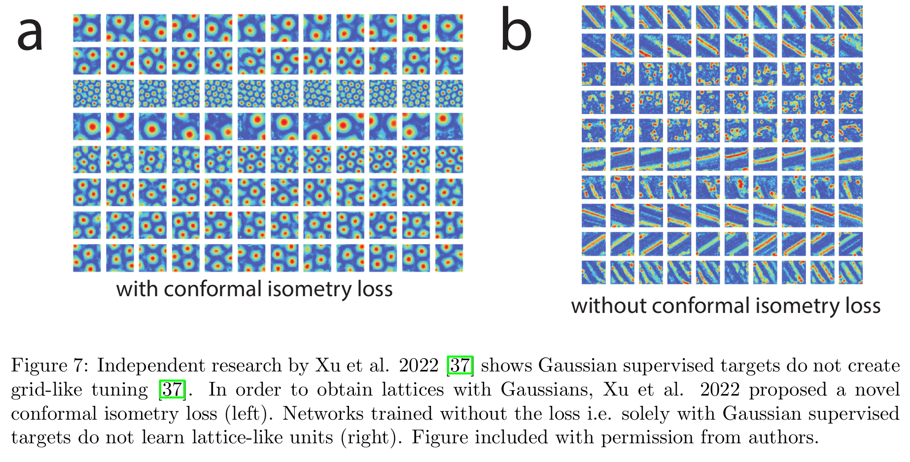

9/N

2c) The Unified Theory predicts that non-negativity constraint should favor hexagonal lattices. We show Tanh->ReLU produces hexagonal AND square lattices in deep path integrators

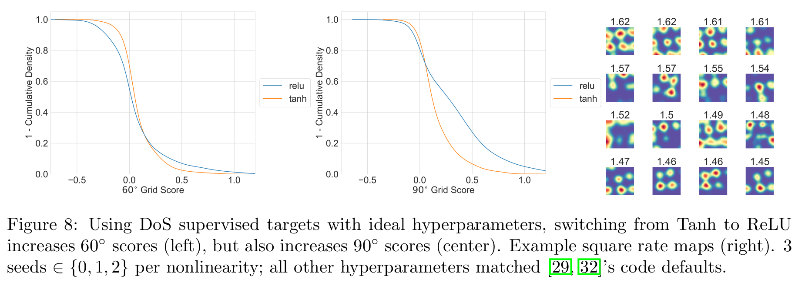

10/N

2d) We reconfirm NFL's finding that even with ideal handcrafted targets, grid-like tuning is highly sensitive to hyperparameters

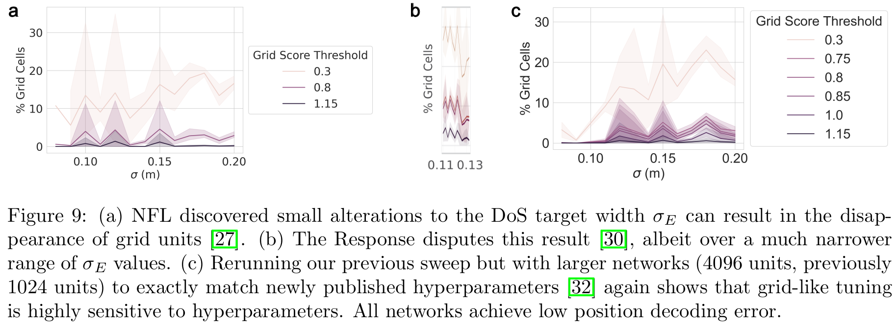

11/N

3. We conclude by questioning neural regressions.  #NeurIPS 2021 Spotlight by @aran_nayebi @dyamins @SuryaGanguli @lisa_giocomo concluded these deep path integrators predict MEC recordings up to noise ceiling

How did neural regressions draw wrong conclusion so confidently?

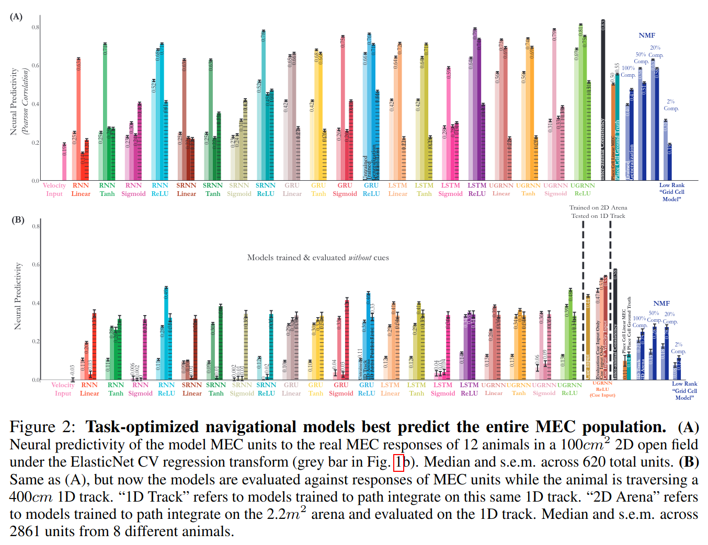

12/N

NFL hypothesized trained networks might achieve higher neural predictivity scores than
competitors simply by providing higher dimensional, richer basis functions

2 indep papers by @EricElmoznino @GretaTuckute found similar trends in different species, modalities, regions

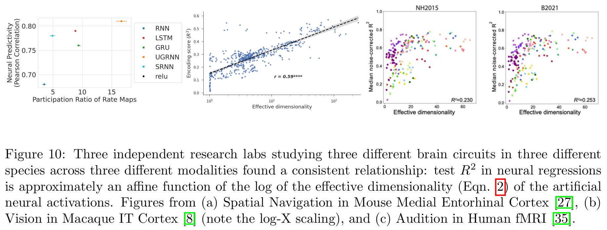

13/N

Preprint: <TODO: Link preprint>

This work was done at & financially supported by @stai_research @StanfordData @StanfordAILab @mitbrainandcog @mcgovernmit

15/N

