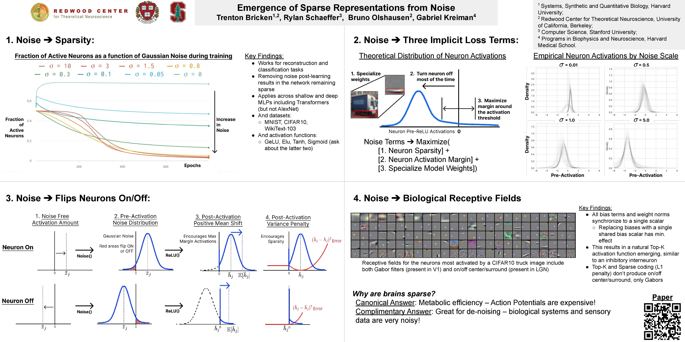
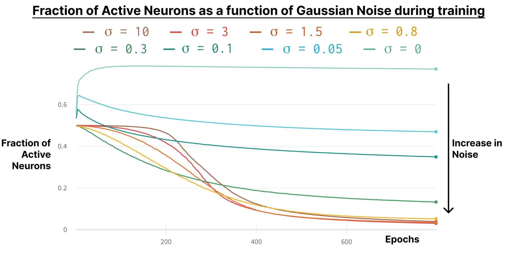
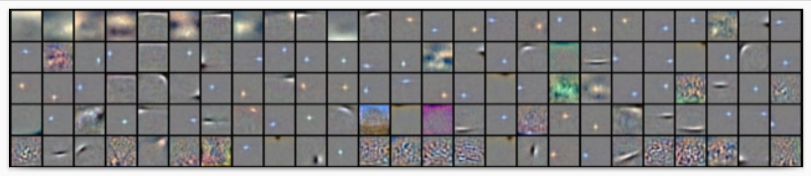
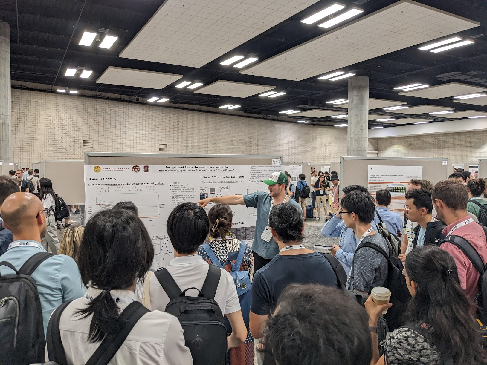
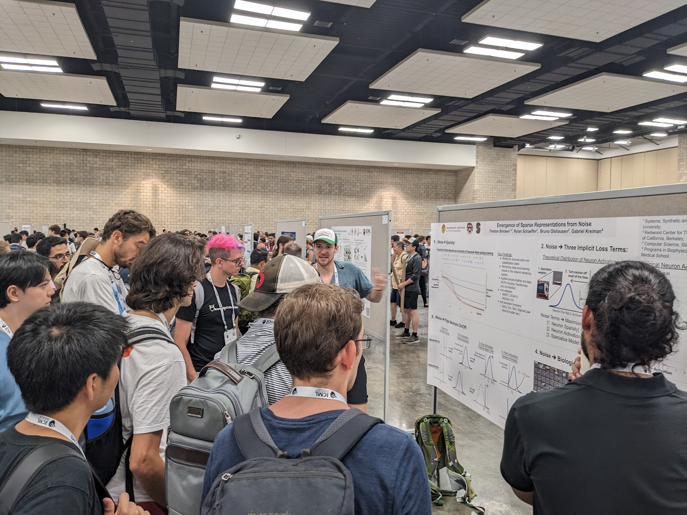
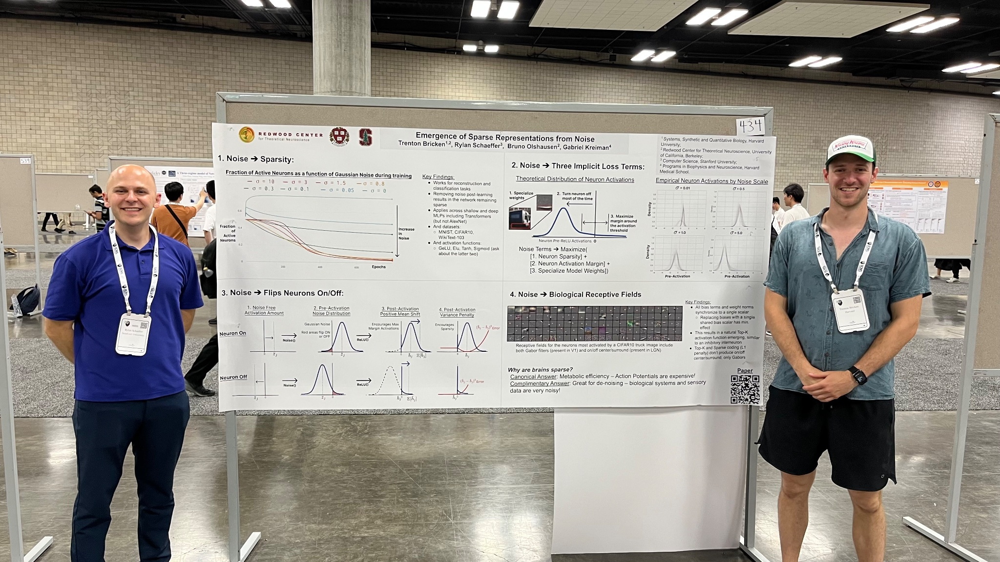
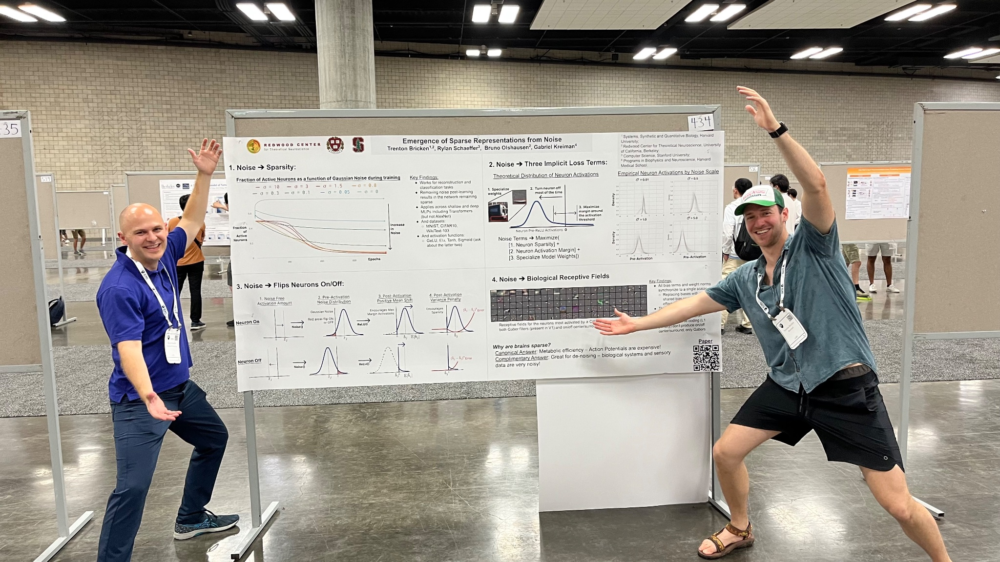
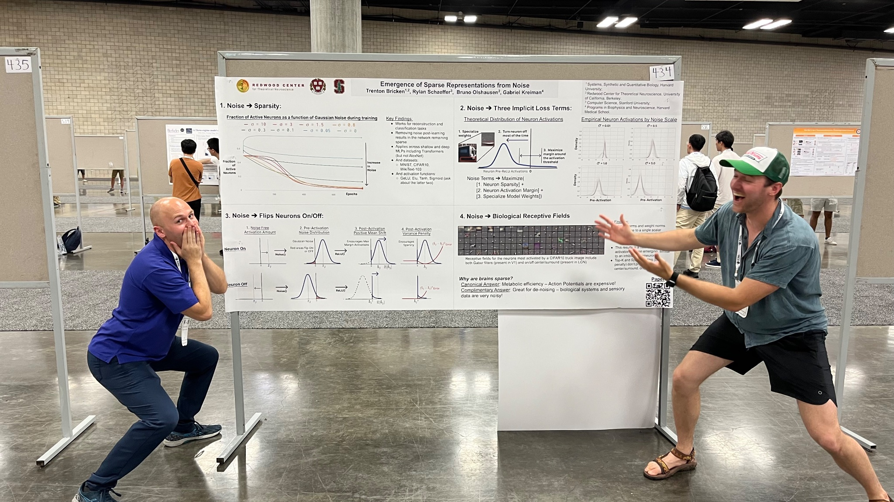

# Emergence of Sparse Representations from Noise

Authors: Trenton Bricken, **Rylan Schaeffer**, Bruno Olshausen, Gabriel Kreiman. 

Venue: ICML 2023

## Quick Links

- [Tweeprint](https://twitter.com/RylanSchaeffer/status/1683654126977314816)
- [Paper](paper.pdf)
- [Poster](poster.pdf)
- [OpenReview](https://openreview.net/forum?id=cxYaBAXVKg)

## Summary

Excited to share our #ICML #ICML2023 paper **Emergence of Sparse Representations from Noise** led by @TrentonBricken
and supervised by Bruno Olshausen, and @gkreiman! 1/8

Neural activations in the brain are estimated to be much sparser than those in artificial neural networks (ANNs). Typical explanation is that action potentials in the brain are metabolically expensive, which doesn’t apply to ANN. We present an alternative complementary answer 2/8

based on a discovery: adding noise to network inputs causes activations to become sparse. Our finding holds across many tasks, datasets, architectures, nonlinearities. This suggests that sparse representations are a useful inductive bias for separating signal from noise. 3/8

When trained on images, neurons also form biological receptive fields and self organize to vaguely resemble an inhibitory interneuron circuit. 4/8

We analytically reveal that noise injection causes **three** implicit loss terms which, in the ReLU activation setting, cause the model to (1) Sparsify,  (2) Maximize its margin around the 0 threshold 5/8

(being either super off or on) (3) Specialize its weights to high variance regions of the input, minimizing weight overlap. This analysis is closely related to earlier work by @poolio
& @jaschasd  6/8

If you’re at ICML, stop by our ICML poster TOMORROW at 11am (HST) Exhibit Hall 1 #434!

We would love to chat more about sparsity and its wonderful advantages 🔥

Paper: http://proceedings.mlr.press/v202/bricken23a/bricken23a.pdf 7/8

Thanks to a number of people for their invaluable feedback, discussions and inspiration including: @BerenMillidge, @FHKPetersen , Fritz Sommer, and Jamie Simon

## Photos from ICML 2023

