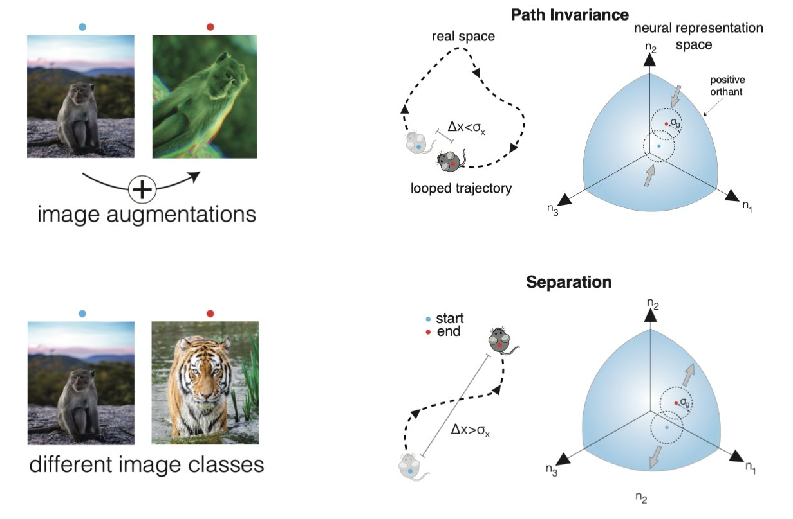

# Self-Supervised Learning of Representations for Space Generates Multi-Modular Grid Cells

Authors: **Rylan Schaeffer**, Mikail Khona, Tzuhsuan Ma, Critobal Eyzaguirre, Sanmi Koyejo, Ila Rani Fiete.

Venue: NeurIPS 2023.

## Quick Links

- [Tweeprint](https://twitter.com/KhonaMikail/status/1732486985099735389)
- [Paper](paper.pdf)
- [Poster](poster.png)
- [Recorded Talk]()

## Summary

Interested in Grid cells 🍩, navigation in blind agents? Self-supervised learning? NeuroAI? We have a #NeurIPS2023 paper w/co-first author @RylanSchaeffer
and @FieteGroup
, @sanmikoyejo

"Self-supervised learning representations of space generates multi-modular grid cells"

1/N

What are grid cells? The mammalian brain has evolved these bizarre non-local multi-periodic representations for physical space, which is a local and non-periodic variable! 🤔🤔

2/N

Why this peculiar representation? We identify and draw from 4 previous approaches: supervised learning, optimization, coding theory and continuous attractors all provided insight, but had their own limitations and assumptions –

3/N

Our work would not have been possible without these previous approaches: we *combine* their strengths,  overcoming limitations by framing spatial navigation as a self-supervised learning problem - the SSL objective is contrastive, similar to objectives like SimCLR!

4/N

An important ingredient in SSL is the data augmentation scheme and architecture: we use an RNN (with a normalizing non-linearity) which takes in velocity sequences and augment our sequences with permutations:

5/N

We find that optimizing this setup *can* generate multi-modular grid cells! 🤯🤯

6/N

We also see that the representation generalizes ~out of distribution~ overcoming limitations in previous work and showing that a multi-modular grid representation is high capacity, as identified by previous theory work from @FieteGroup
@yoramburak
!

7/N

Dissecting a single module using fourier analysis and topological data analysis produces the striking twisted toroidal topology 🍩that grid cells are known for (see amazing experimental and analysis work from @adric_dunn
, @Erik_Hermansen1
@MayBrittMoser
@EdvardMoser
) !

8/N

Read all about it in our paper (which includes thorough ablations to show empirically when grids are optimal or not) and come in person to our poster @ #NeurIPS2023!
Paper: https://arxiv.org/abs/2311.02316
NeurIPS slides: https://neurips.cc/virtual/2023/poster/72628

9/N
