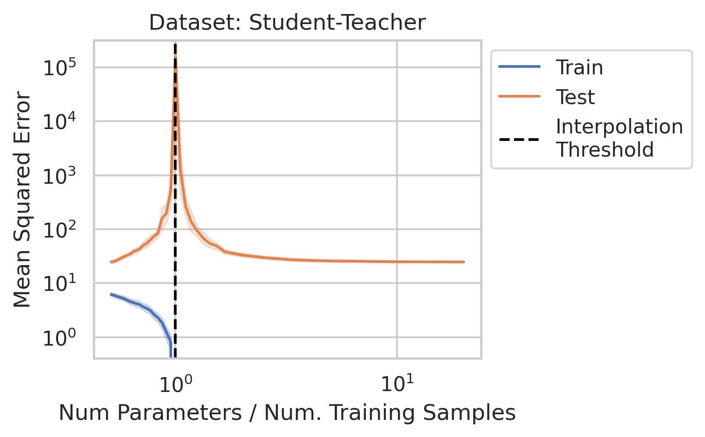
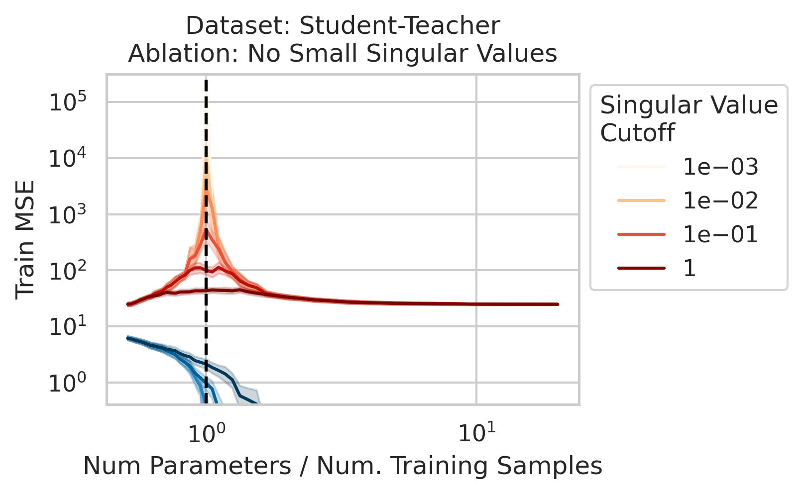
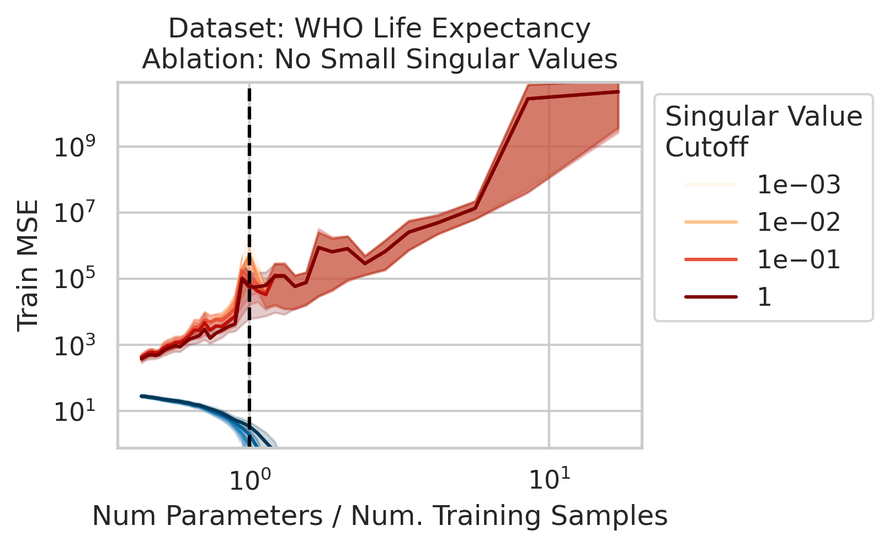
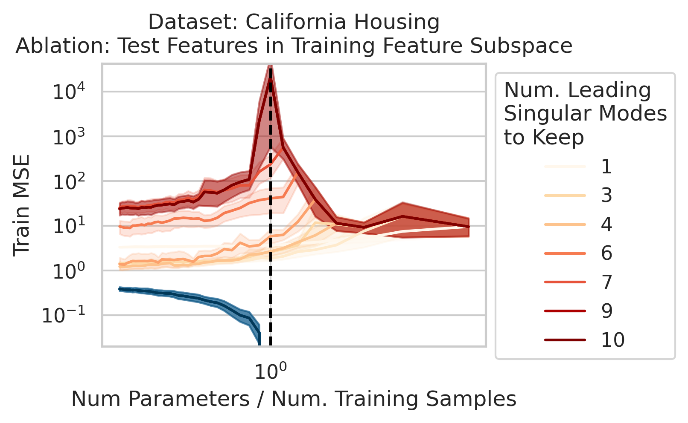
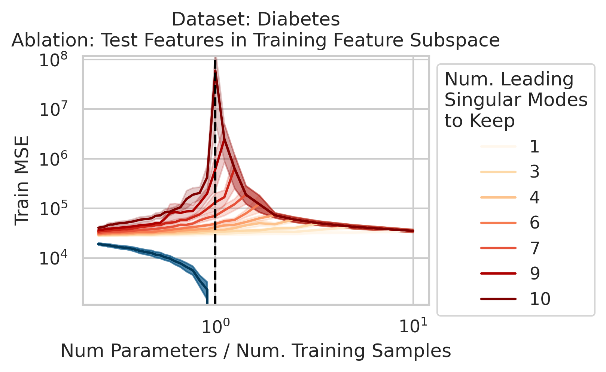
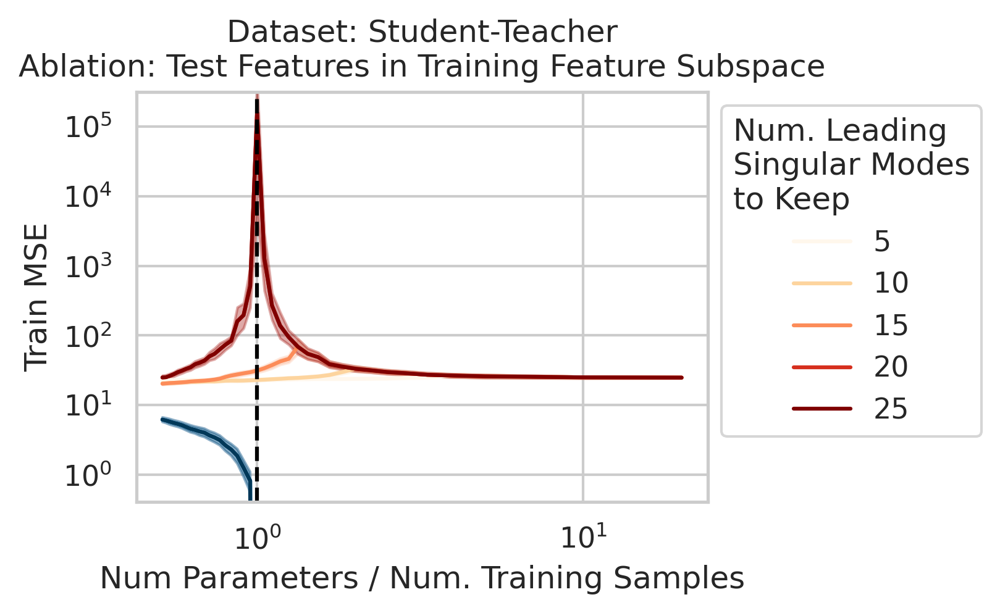
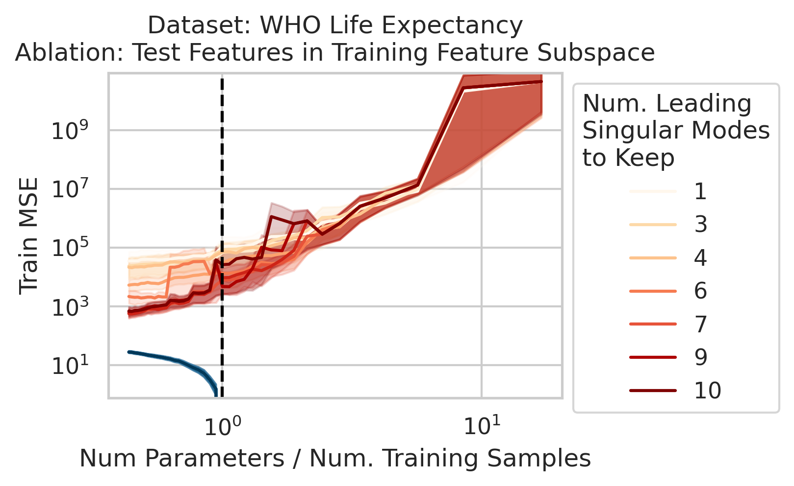
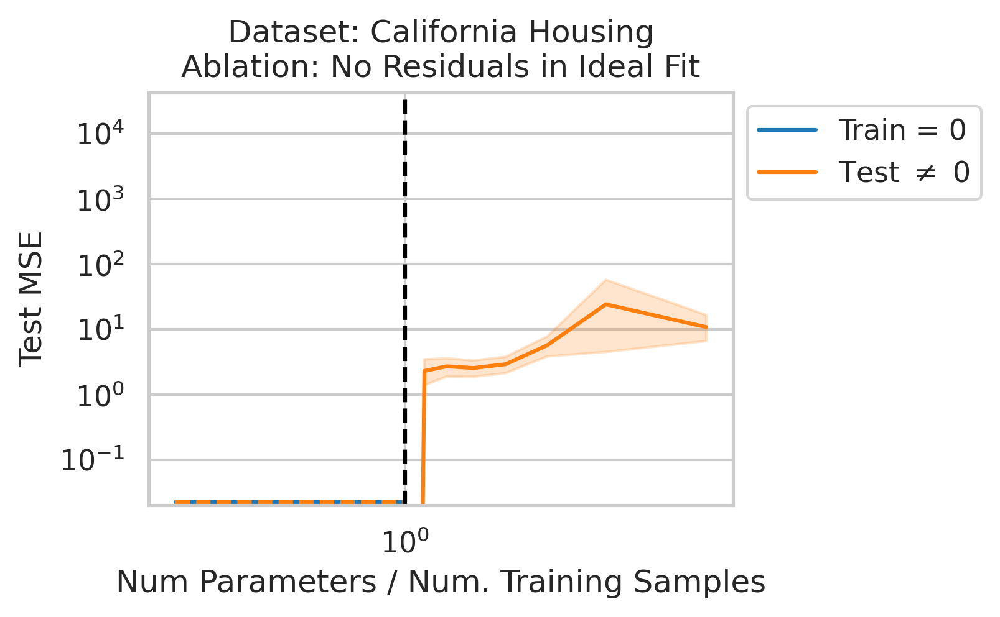
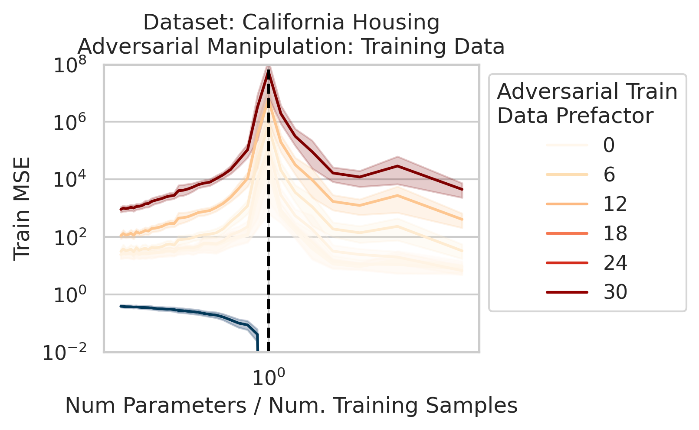

# Title

Authors: **Rylan Schaeffer**, Zachary Robertson, Akhilan Boopathy, Mikail Khona, Ila R Fiete, Andrey Gromov, Sanmi Koyejo

Venue: NeurIPS 2023 Workshops
- [ATTRIB](https://attrib-workshop.cc/)
- [Mathematics of Modern Machine Learning](https://sites.google.com/view/m3l-2023)

## Quick Links

- [Tweeprint](https://twitter.com/RylanSchaeffer/status/)
- [Paper](paper.pdf)
- [Recorded Talk]()

## Summary

Announcing #2 in our #NeurIPS2023 workshop & conference papers series (2/10)!

📈📉 Divergence at the Interpolation Threshold: Identifying, Interpreting & Ablating the Sources of a Deep Learning Puzzle 📈📉

w @sanmikoyejo @stai_research  @KhonaMikail  @Andr3yGR @FieteGroup

1/N

1/N

Why does double descent happen? 🤔

This question has been studied for decades, but we wanted the simplest possible explanation with the fewest assumptions

Using only linear regression and SVD, we identify 3 general interpretable factors and show all 3 are necessary

2/N

Factor 1: How much the training features X vary in each direction; more formally, the inverse
(non-zero) singular values of the training features X

This one is what the literature emphasizes, but it isn't enough!! Two other factors are also necessary

2/N

Factor 2: How much the test features vary relative to the training features X; more formally: how xtest projects onto X’s right singular vectors V 

3/N

Factor 3: How well the best possible model in the model class can correlate the variance in the training features X with the training regression targets Y ; more formally: how the residuals E of the best possible model in the model class project onto X’s left singular vectors U

4/N

When 1&3 occur, parameters along this mode are likely incorrect. When 2 is added to the mix by test data w/  large projection along this mode, the model is forced to extrapolate significantly beyond what it saw in the training data in an error-prone direction => test loss 💥💥

5/N

Why does this happen near the interpolation threshold? We provide geometric intuition for why the smallest non-zero singular value probabilistically reaches its smallest value near the interpolation threshold

6/N

We also use this viewpoint to construct adversarial *training data* that destroy the model on the test loss without noticeably affecting the training loss. We can also explain adversarial test examples

7/N
This work was motivated by @AnthropicAI's work on superposition & double descent by  Tom Henighan, @shancarter , @trishume , @nelhage & @ch402

https://twitter.com/AnthropicAI/status/1611045993516249088

& by @daniela_witten's beautiful explanation of double descent via splines
https://twitter.com/daniela_witten/status/1292293102103748609

8/N

We also clarify several misconceptions:

1. "Memorization" and "Generalization" isn't the right dichotomy. Memorizing solutions **can** generalize, and often do!

2. Noise/random is NOT necessary for double descent - what's necessary is errors by the best possible model in the model class

9/N

This work requires only linear regression and SVD (no random matrix theory, no replica calculations, no kernel methods) but offers simple, general and intuitively insights.

We really hope this material will be included in undergrad ML curricula as its so foundational!

10/N

This work was made possible by Jason W. Rocks and done by several not on Twitter: Zach Robertson, Akhilan Boopathy

Collaborators from multiple wonderful places including @stai_research @StanfordData @StanfordAILab @mitbrainandcog @mcgovernmit

11/N