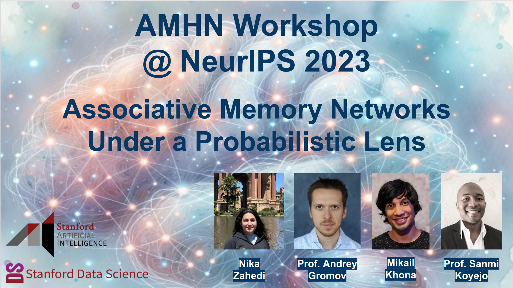
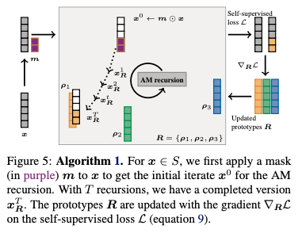
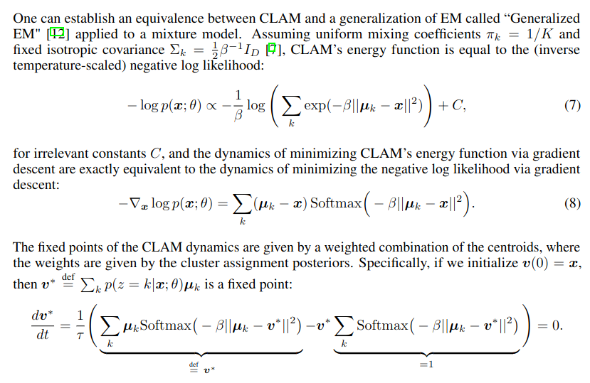
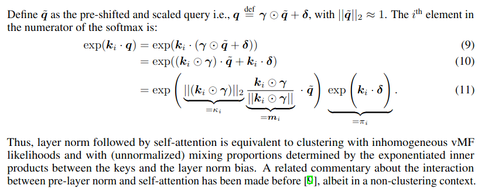
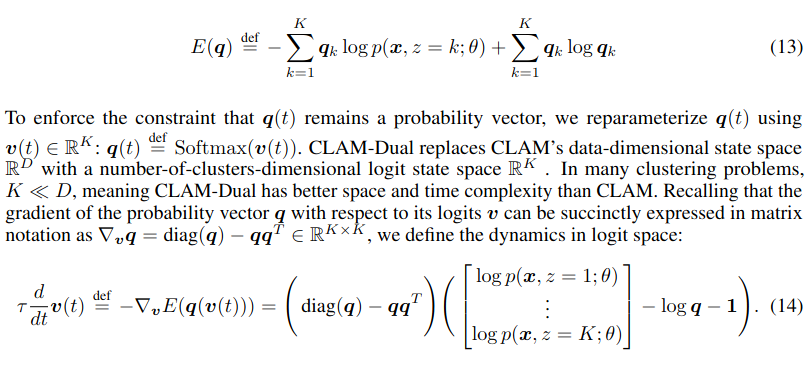
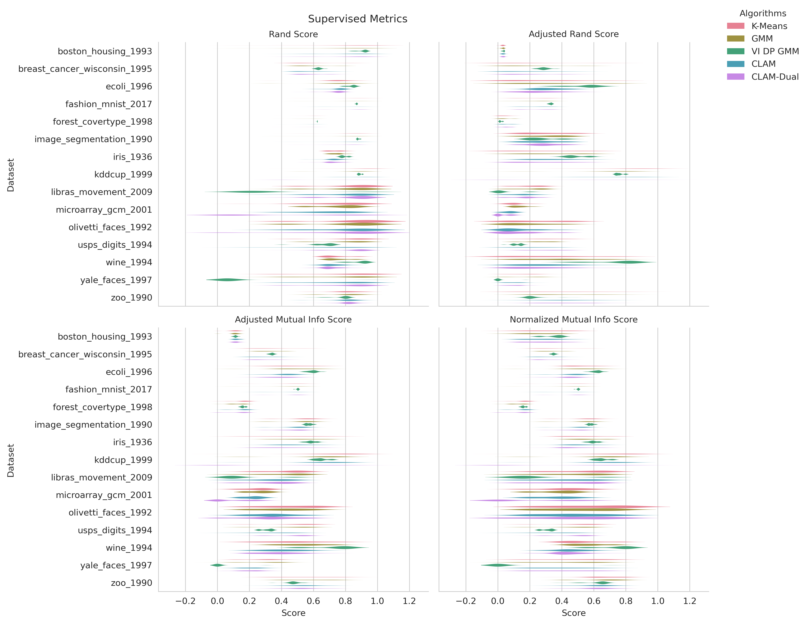
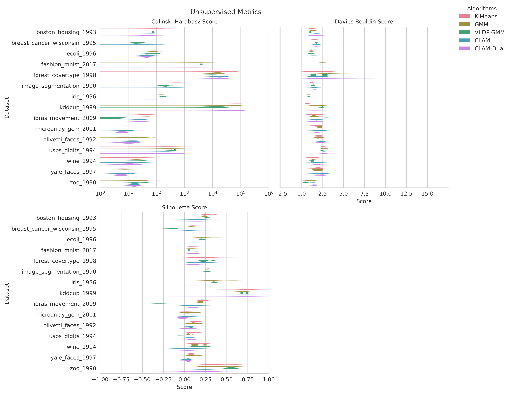
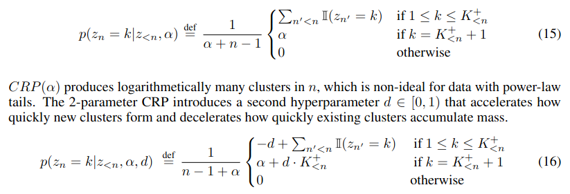

# Associative Memory Under the Probabilistic Lens: Improved Transformers & Dynamic Memory Creation

Authors: **Rylan Schaeffer**, Mikail Khona, Nika Zahedi, Mitchell Ostrow, Ila Rani Fiete, Andrey Gromov, Sanmi Koyejo

Venue: NeurIPS 2023 Workshops
- [Associative Memory & Hopfield Networks](https://amhn.vizhub.ai/)

## Quick Links

- Tweeprint
- [Paper](paper.pdf)
- Poster
- Recorded Talk
- [OpenReview](https://openreview.net/forum?id=lO61aZlteS)
- Slides

-----

## Summary

Announcing #1 in our #NeurIPS2023 workshop & conference papers series (1/8)!

🔎 Associative Memory Under the Probabilistic Lens 🔍

w Nika Zahedi @KhonaMikail @Andr3yGR @sanmikoyejo @neurostrow @FieteGroup

Appearing @ Associative Memory & Hopfield Networks Workshop !

🧵👇

1/7

At #ICML2023 , @Bishwajit_Sahab @DimaKrotov @mj_zaki @p_ram_p showed that modern associative memory networks can be used for clustering via a particular energy function and dynamics

https://twitter.com/Bishwajit_Sahab/status/1669374707374669824

2/7

In our work, we mathematically show that the associative memory (AM) clustering corresponds to generalized
expectation maximization via gradient ascent in a homogeneous isotropic Gaussian mixture model, 
with fixed points that correspond to the posterior-weighted memories

3/7 

Based on connection between self-attention and associative memory networks by @HRamses2 @DimaKrotov @BerenMillidge ,  we can re-interpret pre-norm + self-attention in transformers as clustering on hypersphere with inhomogeneous von Mises-Fisher mixture model (not yet tested)

4/7

We also propose a "dual" AM network to @Bishwajit_Sahab 's #ICML2023 AM network

Novel energy & dynamics => Faster runtime & computation of cluster assignment posteriors

Also exhibits self-excitation & mutual inhibition dynamics (long-standing theme in neuro)

5/7

We also propose a NEW associative memory network with ability to dynamically create new memories in its forward dynamics, as necessitated by the data

To do this, we use combinatorial stochastic processes from Bayesian nonparametrics to define new energy function & dynamics

6/7

Very excited to push this work forward. There are exciting insights towards #NeuroAI as well

Appearing @ AMHN https://amhn.vizhub.ai/ !!

Work done w amazing collaborators @stai_research @StanfordData @StanfordAILab @mitbrainandcog @mcgovernmit

❤️‍🔥❤️‍🔥❤️‍🔥

7/7
