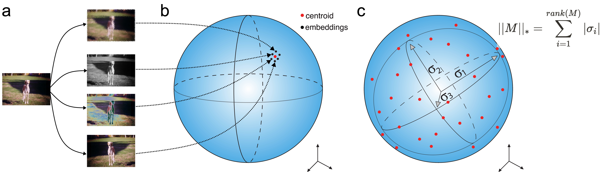
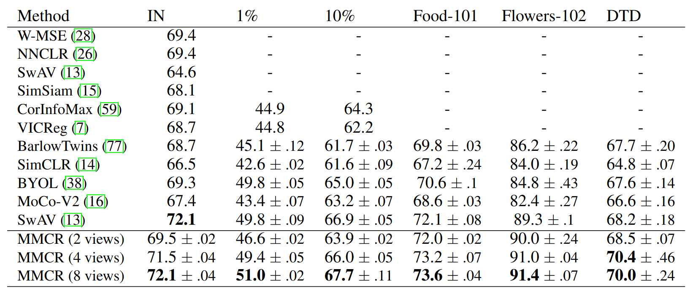
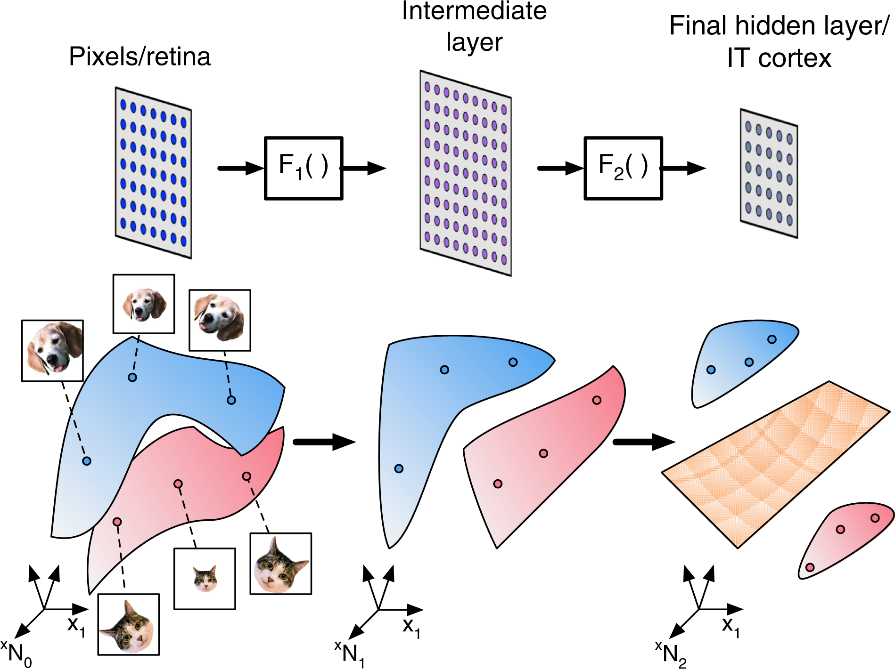
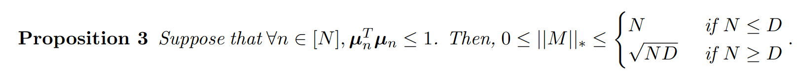
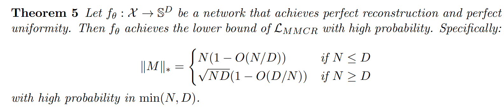
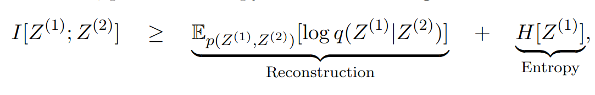
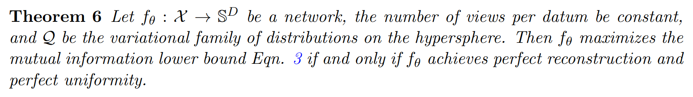
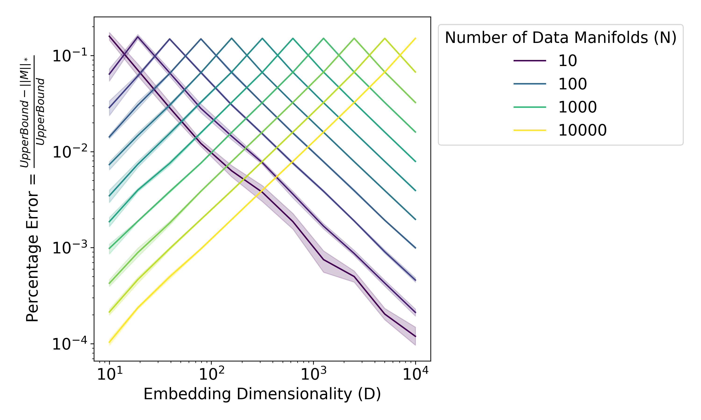
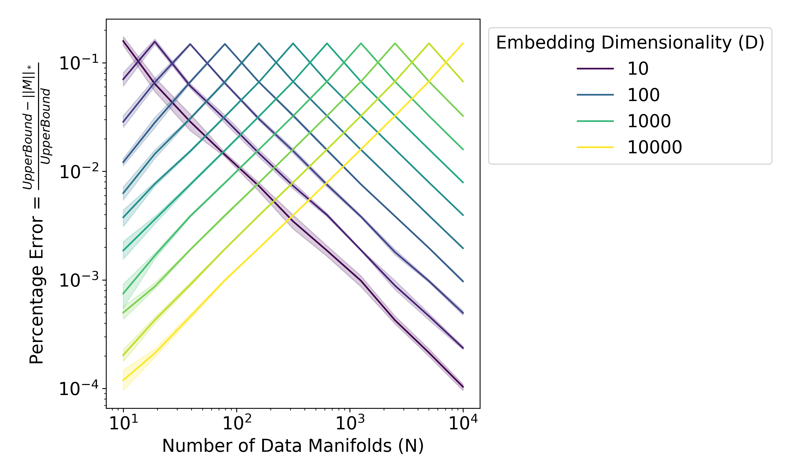

# An Information-Theoretic Understanding of Maximum Manifold Capacity Representations

Authors: **Rylan Schaeffer**, Berivan Isik, Victor Lecomte, Mikail Khona, Yann LeCun, Andrey Gromov, Ravid Shwartz-Ziv, Sanmi Koyejo

Venue: NeurIPS 2023 Workshops:
- [Unifying Representations in Neural Models](https://unireps.org/) **Oral**
- [Information-Theoretic Principles in Cognitive Systems](https://sites.google.com/view/infocog-neurips-2023/)  **Spotlight**
- [Symmetry and Geometry in Neural Representations)](https://www.neurreps.org/)
- [Self-Supervised Learning - Theory and Practice](https://sslneurips23.github.io/)

## Quick Links

- [Tweeprint](https://twitter.com/RylanSchaeffer/status/1729173604678660433)
- [Paper](paper.pdf)
- [Poster](poster.png)
- Recorded Talk

## Summary

Excited to begin announcing our #NeurIPS2023 workshop & conference papers (1/10)!

🔥🚀An Information-Theoretic Understanding of Maximum Manifold Capacity Representations🚀🔥

w/ amazing cast @vclecomte @BerivanISIK @sanmikoyejo @ziv_ravid @Andr3yGR @KhonaMikail @ylecun

1/7

MMCR is a new high-performing self-supervised learning method at #NeurIPS2023 by @tedyerxa @s_y_chung @KuangYilun @EeroSimoncelli that SLAYS 🚀🚀🚀

MMCR: Data -> K transforms per datum -> Embed -> Average over K transforms -> Minimize negative nuclear norm

2/7

MMCR originates from the statistical mechanical characterization of the linear separability of manifolds, building off foundational work by @s_y_chung @UriCohen42 @HSompolinsky

But what is this MMCR computational graph actually doing?

3/7

We leverage tools from high dimensional prob & info theory to demonstrate that optimal solution to MMCR's nuclear norm loss is the same optimal solution that maximizes lower bound on mutual info btwn views

Specifically, we show that MMCR's loss has a lower bound, then...

4/7

prove that a network with (1) perfect reconstruction (i.e. invariance) and (2) perfect uniformity achieves this loss lower bound with high probability

This configuration of embeddings maximizes a well-known lower bound on the mutual information between multiple views

5/7

Numerical simulations confirm our maths, showing that the gap between MMCR's optimal loss and the loss achieved by invariant & uniform embeddings falls as a power in the number of manifolds (N) and in the ambient dimension (D), peaking at the N=D threshold

6/7

Appearing @ 4 workshops: @unireps (oral) InfoCog (spotlight) @neur_reps SSL  !!

Work done with amazing collaborators across many institutions @stai_research @StanfordData @StanfordAILab @NYUDataScience @mitbrainandcog @mcgovernmit @AIatMeta

❤️‍🔥❤️‍🔥❤️‍🔥

& stay tuned!

7/7

