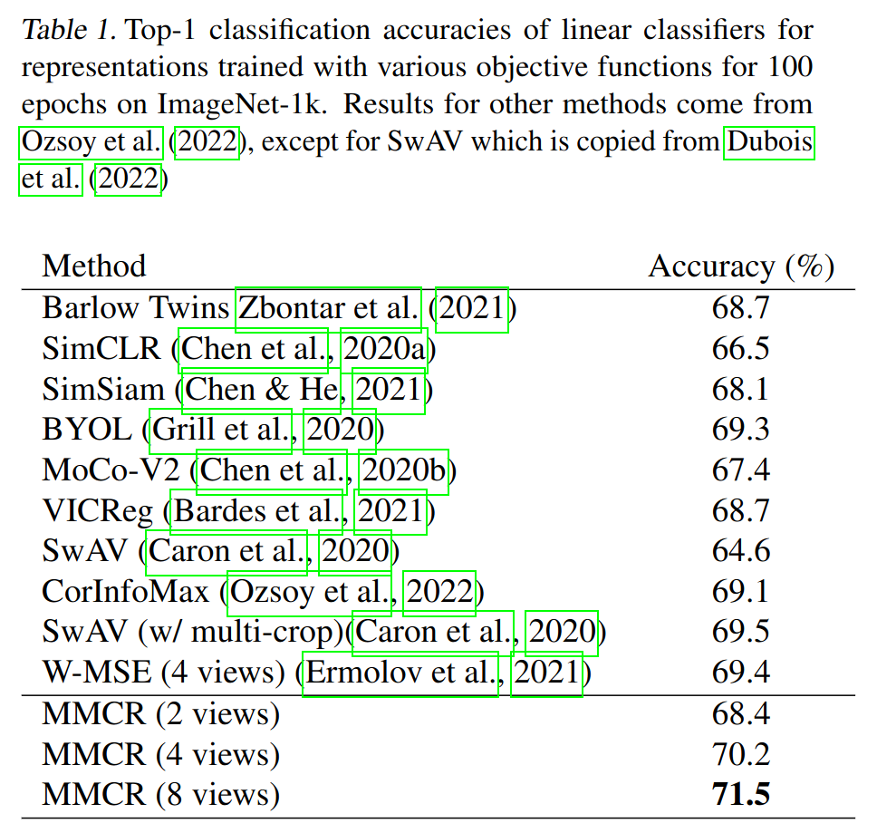

# An Information-Theoretic Understanding of Maximum Manifold Capacity Representations

Authors: **Rylan Schaeffer**, Berivan Isik, Victor Lecomte, Mikail Khona, Yann LeCun, Andrey Gromov, Ravid Ziv-Schwarz, Sanmi Koyejo

Venue: NeurIPS 2023 Workshops:
- [Symmetry and Geometry in Neural Representations)](https://www.neurreps.org/) **Oral**
- [Unifying Representations in Neural Models](https://unireps.org/) **Oral**
- [Information-Theoretic Principles in Cognitive Systems](https://sites.google.com/view/infocog-neurips-2023/)  **Spotlight**
- [Self-Supervised Learning - Theory and Practice](https://sslneurips23.github.io/)

## Quick Links

- Tweeprint
- [Paper](paper.pdf)
- Recorded Talk

## Summary

Excited to begin announcing our #NeurIPS2023 workshop & conference papers (1/10)!

🔥🔥An Information-Theoretic Understanding of Maximum Manifold Capacity Representations🔥🔥

w/ amazing cast @vclecomte @BerivanISIK @sanmikoyejo  @ziv_ravid @Andr3yGR @ylecun @KhonaMikail

1/N

What is MMCR? MMCR is a new high-performing self-supervised learning method at #NeurIPS2023 by @tedyerxa @s_y_chung @KuangYilun @EeroSimoncelli that SLAYS at ImageNet1k 🚀🚀🚀

How does it work?

Data -> Transform -> Embed -> Average over views/transforms -> Max nuclear norm

2/N

MMCR originates from stat mech characterization of the geometry of linear separability of manifolds, building off foundational work by @s_y_chung @UriCohen42 @HSompolinsky

But many SSL methods originate from (or relate to) information theory! How can we connect these?

3/N

We leverage tools from high dim prob & info theory to demonstrate that optimal solution to MMCR's nuclear norm loss function is the same optimal solution that maximizes well-known lower bound on MI between views

Specifically, we show that MMCR's loss has a lower bound, then

4/N

prove that a network with (1) perfect invariance and (2) perfect uniformity achieves this loss lower bound with high probability

This configuration of embeddings maximizes a well-known lower bound on the mutual information between  multiple views

5/N

Numerical simulations confirm our maths, showing power law scaling of the gap between MMCR's optimal loss and uniform embeddings with the number of manifolds and the ambient dimension 

6/N

Appearing @ 4 workshops: @neur_reps (oral) @unireps (oral) InfoCog (spotlight) and SSL !!

Work done with amazing collaborators across powerhouse institutions @stai_research @StanfordAILab @StanfordData @AIatMeta @NYUDataScience @mitbrainandcog @mcgovernmit

❤️‍🔥❤️‍🔥❤️‍🔥

