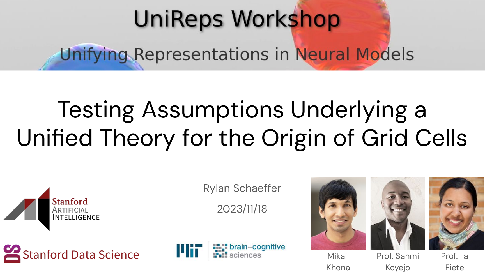
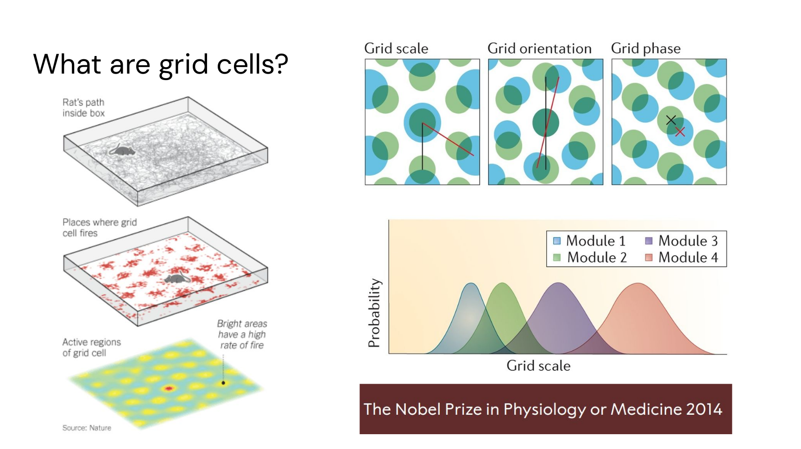
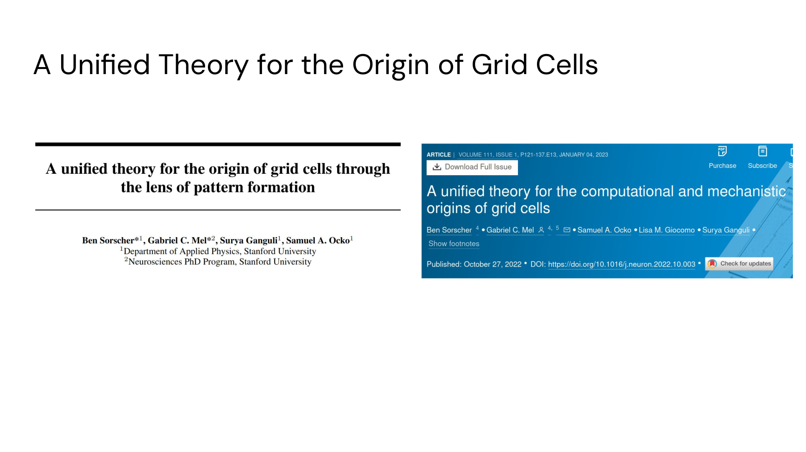
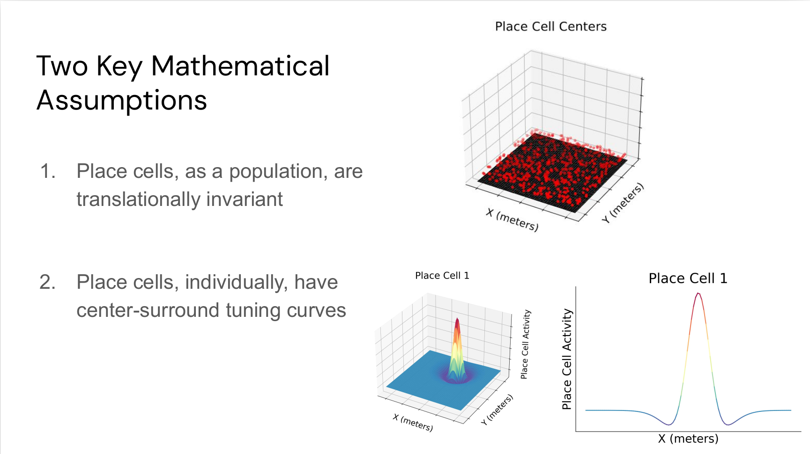
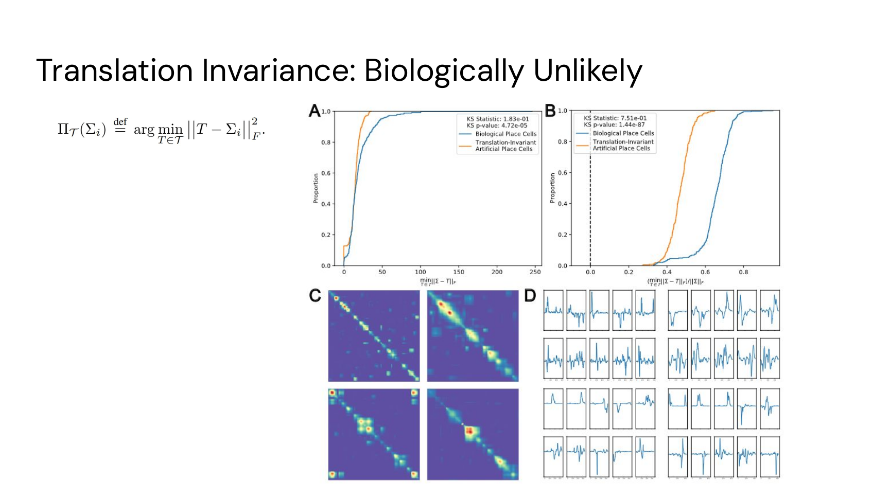
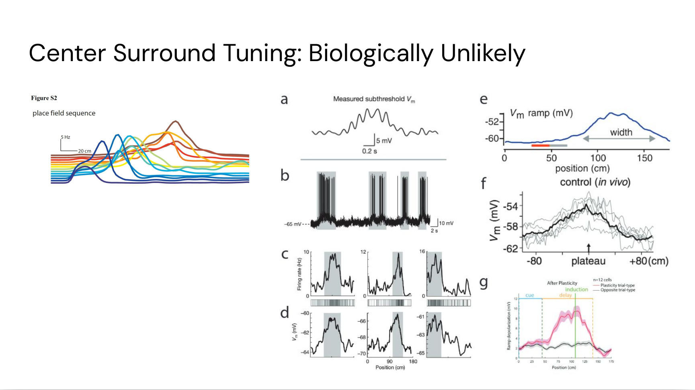

# Testing Assumptions Underlying a Unified Theory for the Origin of Grid Cells

Authors: **Rylan Schaeffer**, _Mikail Khona_, Adrian Bertagnoli, Sanmi Koyejo, Ila Rani Fiete 

Venue: NeurIPS 2023 Workshops:
- [Symmetry and Geometry in Neural Representations](https://www.neurreps.org/)
- [Unifying Representations in Neural Models](https://unireps.org/)
- [AI for Science](https://ai4sciencecommunity.github.io/neurips23.html)

## Quick Links

- Tweeprint
- [Paper](paper.pdf)
- Recorded Talk
- [Slides](slides.pdf)

## Summary

Stoked to begin announcing our #NeurIPS2023 conference & workshops papers, starting with 1/?:

🔥🔥Testing Assumptions Underlying a Unified Theory for the Origin of Grid Cells🔥🔥

Joint @KhonaMikail @sanmikoyejo @FieteGroup

Appearing @ NeurReps, UniReps & AI4Science

🧠🧵👇

1/7

Grid cells are a Nobel-prize winning 🏆🏆🏆 neural representation found in the mammalian brain 🧠, that play a fundamental role in spatial navigation 🚶 🛣️

Where do these representations come from ⁉️ 🔎

2/7

One leading theory is the so-called "Unified theory for the origin of grid cells"

The Unified Theory posits that grid cells arise due to predicting place cells, another type of neural representation 🧠

3/7

We rigorously test the Unified Theory's applicability to biological grid cells.

We identify 2 critical mathematical assumptions:

1) Place cells, as a population, must be translationally invariant

2) Place cells, individually, must have center-surround tuning

4/7

Using 320 recording sessions, we propose 2 ways to quantify whether place cells are translationally invariant

Under both metrics, this assumption appears biologically unlikely ❌

Also, spatial autocorrelation matrices don't display the constant-diagonal structure required

5/7

Extracellularly, place cells don't exhibit center-surround tuning (left). 

We dig through the literature to also discover place cell intracellular potentials, which also do not exhibit center surround tuning (right)

This assumption also appears biologically unlikely ❌

6/7

Together, this casts doubt on the Unified Theory's relevance to bio grid cells 🤔

OpenReviews:
UniReps: https://openreview.net/forum?id=vYixJUwAD4
NeurReps: https://openreview.net/forum?id=CwJIpWzgDP
AI4Science https://openreview.net/forum?id=vYixJUwAD4

@mitbrainandcog @mcgovernmit @stai_research  @StanfordAILab @StanfordData

7/7