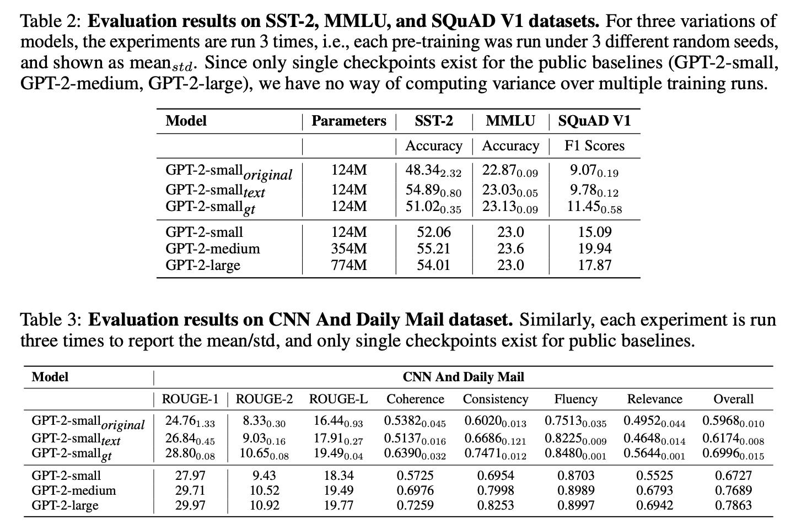
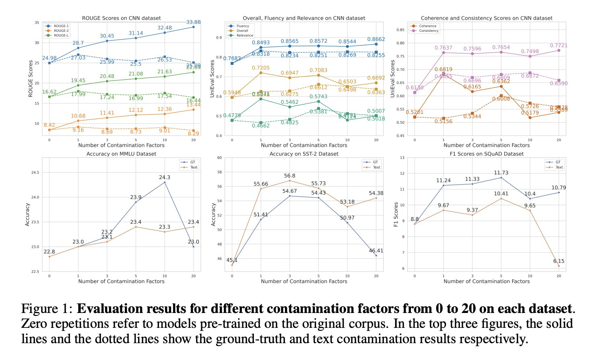
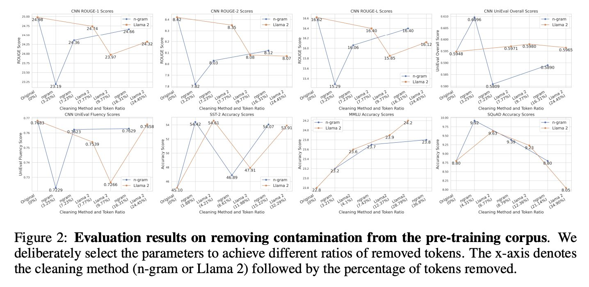
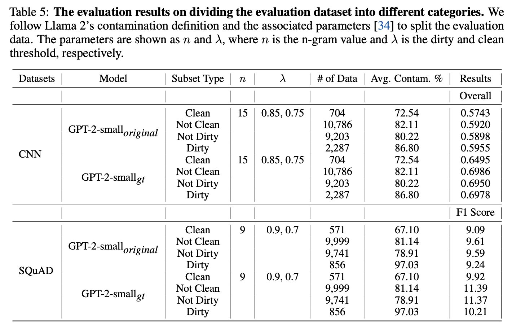

# Does Data Contamination Make a Difference? Insights from Intentionally Contaminating Pre-training Data for Language Models.

Authors: Minhao Jiang, Ken Liu, Ming Zhong, Rylan Schaeffer, Siru Ouyang, Jiawei Han, Sanmi Koyejo.

Venue: Arxiv 2024.
- Awards:
  - Best Paper at [ICLR 2024's Data Problems for Foundation Models Workshop](https://sites.google.com/view/dpfm-iclr24/home)

Disclaimer: My contribution to this work was limited to (1) proposing the main question and (2) proposing specific experiments, e.g., ratcheting up the amount of data contamination.
I did not contribute to implementing the experiments.

## Quick Links

- [Paper](paper.pdf)
- [Poster](poster.png)
- [Tweeprint](https://twitter.com/minhaoj_uiuc/status/1746938689459032476)

## Summary

Note: The following is copied from Minhao Jiang's Tweeprint.

========================================================

📢Excited to share our new paper "Investigating Data Contamination for Pre-training Language Models"!

We analyze the effects of data contamination in the pre-training stage of LMs by pre-training & studying GPT-2 models🚀.

Paper: https://arxiv.org/abs/2401.06059

1/N

🧵

To quantify how data contamination affects LM performance in downstream tasks, we deliberately introduce contamination into pre-training corpora in two ways (text contamination & ground truth contamination) 📝.

2/N

The ground-truth contamination can significantly improve the model's performance 📈, highlighting the importance of considering ground-truths in the contamination analysis; while text contamination does not show such enhancement.

3/N

Perhaps surprisingly, more repetitions aren't always better!! The effect of data contamination can be U-Shaped 📈📉in the number of times that eval data is repeated in the pre-training corpus.

4/N

We find that commonly used n-gram-based methods for detecting contamination in the existing studies have drawbacks 🤔.

5/N

We critically analyze the current assessment of contamination in the existing LLM reports and point out that current evaluation practices used in previous reports are insufficient 🧐.

6/N

Great thanks to my collaborators for their help and suggestions @kenziyuliu
, @MingZhong_
, @RylanSchaeffer
, @Siru_Ouyang
, Prof. Jiawei Han, @sanmikoyejo
👏!
@stai_research
@uiuc_nlp

Code implementations for the experiments are available at https://github.com/minhaoJ2/contamination_analysis.

7/N