# Why Has Predicting Downstream Capabilities of Frontier AI Models with Scale Remained Elusive?

Authors: Rylan Schaeffer, Hailey Schoelkopf, Brando Miranda, Gabriel Mukobi, Varun Madan, Adam Ibrahim, Herbie Bradley, Stella Biderman, Sanmi Koyejo

Venue: Arxiv 2024.

## Quick Links

- [Paper](paper.pdf)

## Summary

❤️‍🔥❤️‍🔥Excited to share our new paper ❤️‍🔥❤️‍🔥

**Why Has Predicting Downstream Capabilities of Frontier AI Models with Scale Remained Elusive?**   w/ @haileysch__ @BrandoHablando @gabemukobi @varunrmadan @herbiebradley @ai_phd @BlancheMinerva @sanmikoyejo

https://arxiv.org/abs/2406.04391

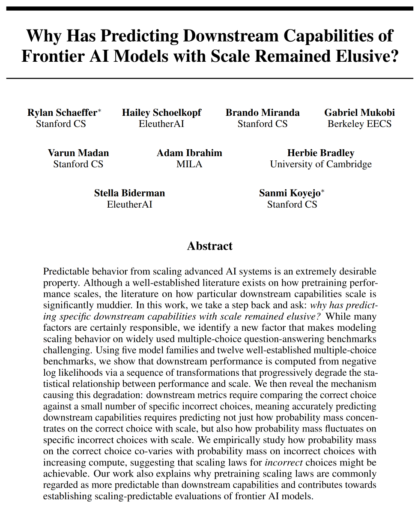

1/N

Predictable behavior from scaling AI systems is extremely desirable. While scaling laws are well established, how particular downstream capabilities scale is significantly muddier
@sy_gadre @lschmidt3 @ZhengxiaoD @jietang

https://arxiv.org/abs/2403.08540

https://arxiv.org/abs/2403.15796

Why??

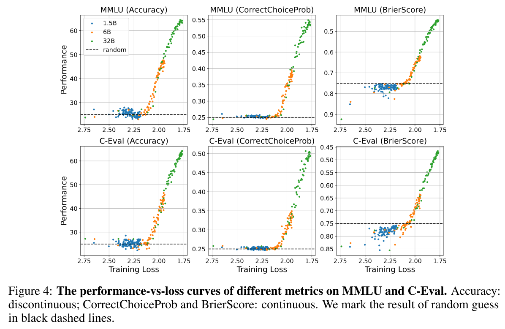

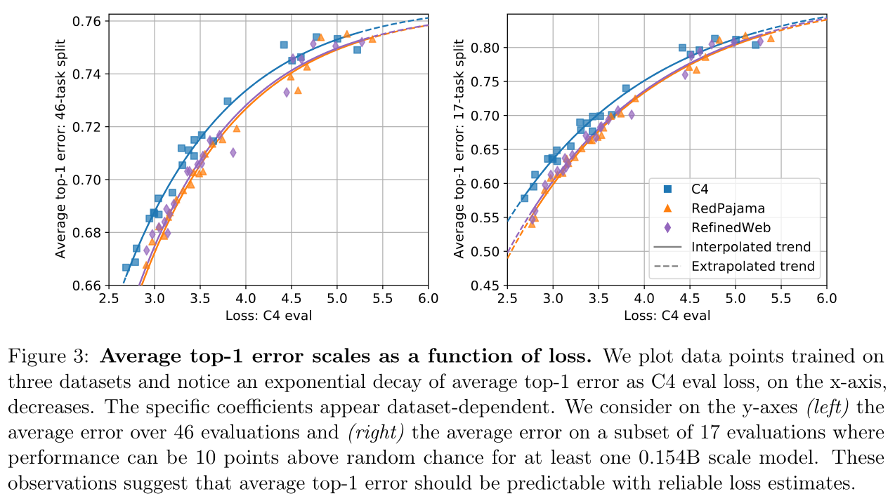

2/N

We identify a new factor for widely-used multiple choice QA benchmarks e.g. MMLU:

Downstream performance is computed from negative log likelihoods via a sequence of transformations that progressively deteriorate the statistical relationship between performance and scale

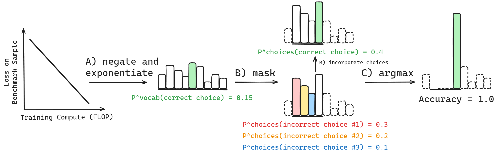

3/N

Specifically, for a single sample in a benchmark, to compute Accuracy, NLLs are transformed into probabilities, then renormalized based on the available choices, then thresholded

This sequence of transformations decorrelates performance from scale ☠️

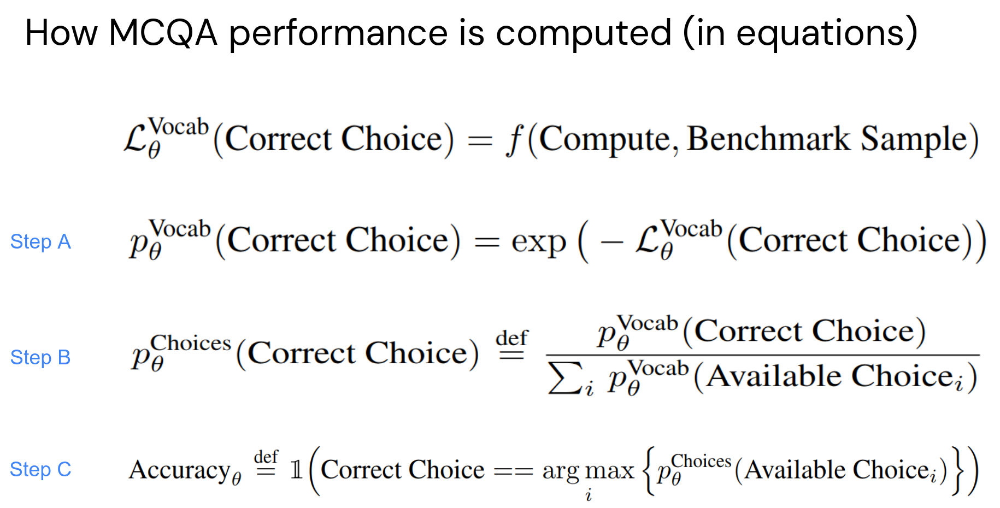

4/N

To demonstrate this, we compute how correlated scores are with pretraining compute across a range of models and multiple-choice QA benchmarks

In log probability space, we find that scores are highly correlated with compute

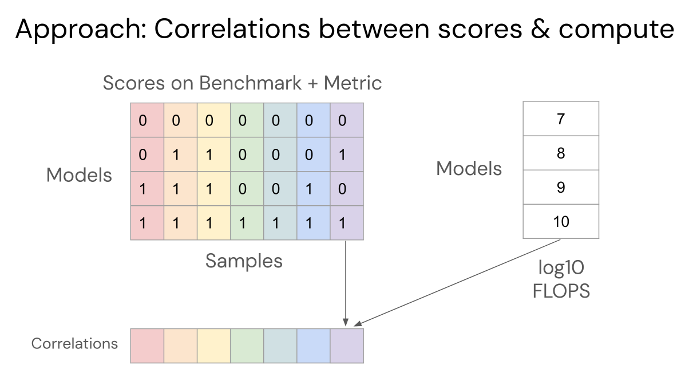

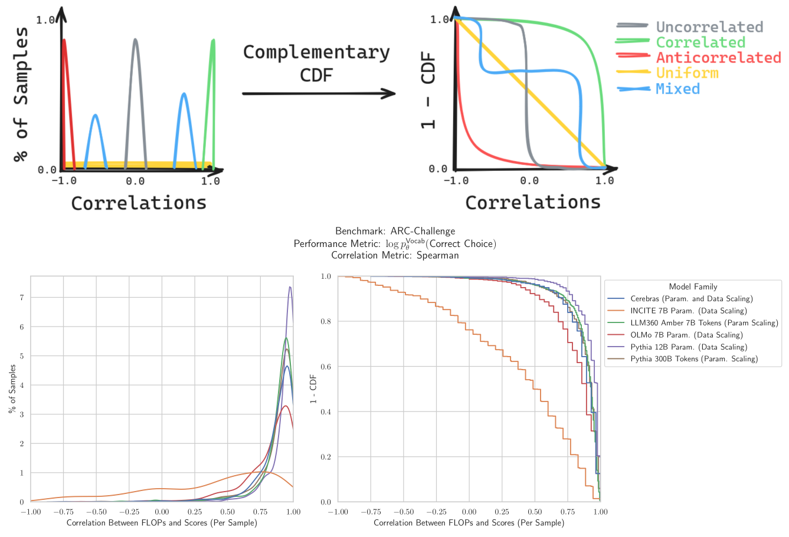

5/N

But as we transform scores into probabilities, and then mask based on the **incorrect** choices, the correlations between
scores and pretraining compute drops. These correlations falls further for Accuracy.

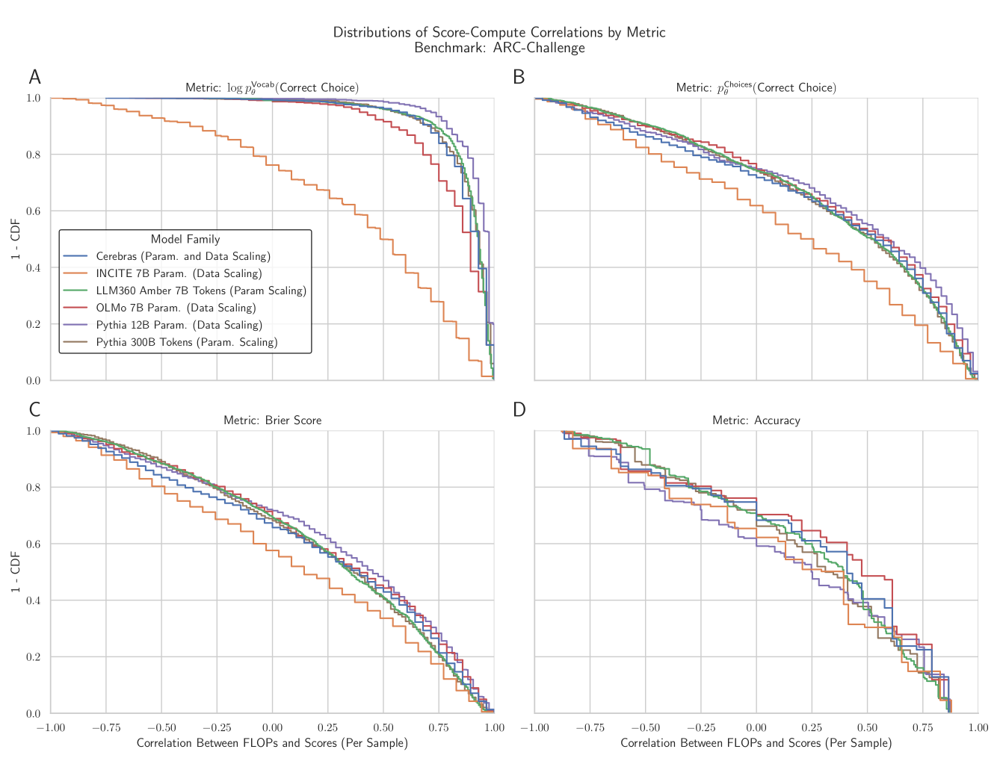

6/N

We demonstrate quantitatively that this sequence of transformations to compute Accuracy degrades score-compute correlations across all MCQA benchmarks we tried including @DanHendrycks MMLU, @allen_ai ARC, @tbmihaylov OpenbookQA @rown HellaSwag etc.

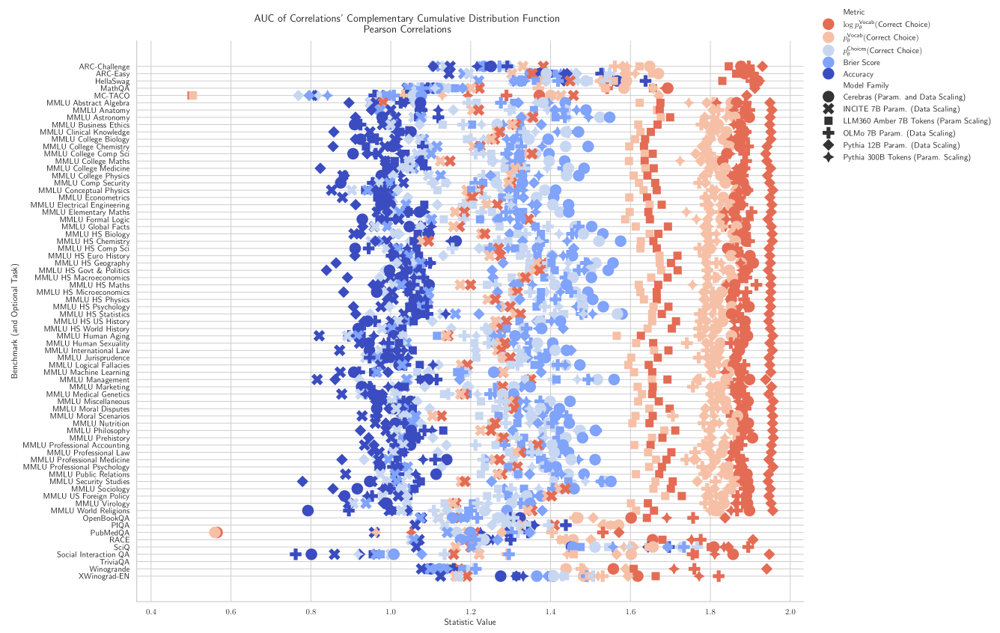

7/N

What is the mechanism that causes this degradation? The incorrect choices!! Measuring performance on these benchmarks
requires comparing the correct choices to the specific incorrect choices, which wrecks predictability!

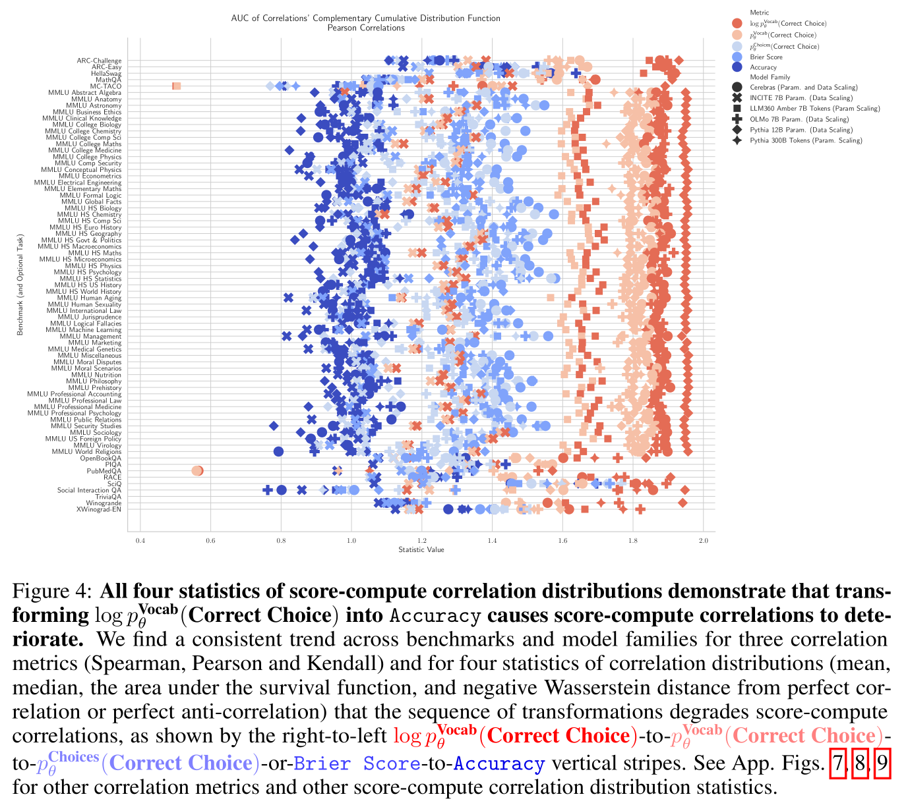

8/N

What do models do for incorrect choices with increasing scale? We find that probablility mass increasingly concentrates on both
the correct AND incorrect choices (although the variance is quite high - several orders of magnitude!) 

This is why predicting downstream capabilities from scale has remained elusive!

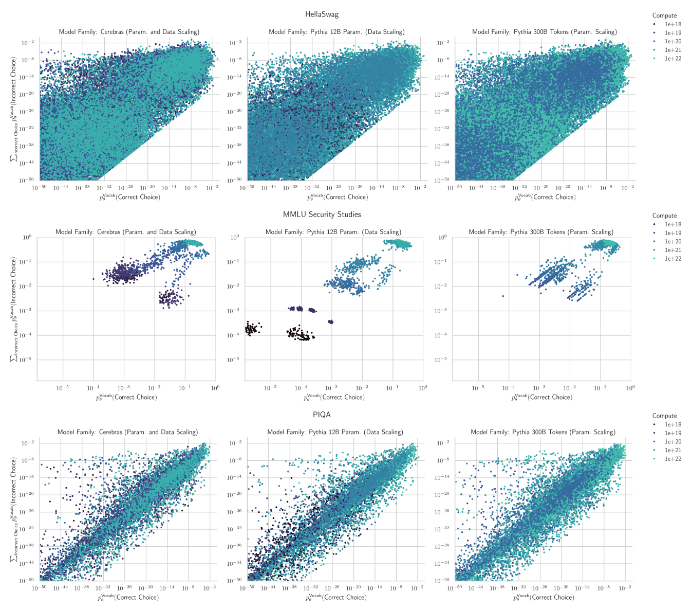

9/N

Work done at @stai_research @StanfordAILab @AiEleuther

w/ 🙏🙏🙏 to support from @StanfordData @OpenAI Superalignment @NSF @SloanFoundation @GoogleAI
 