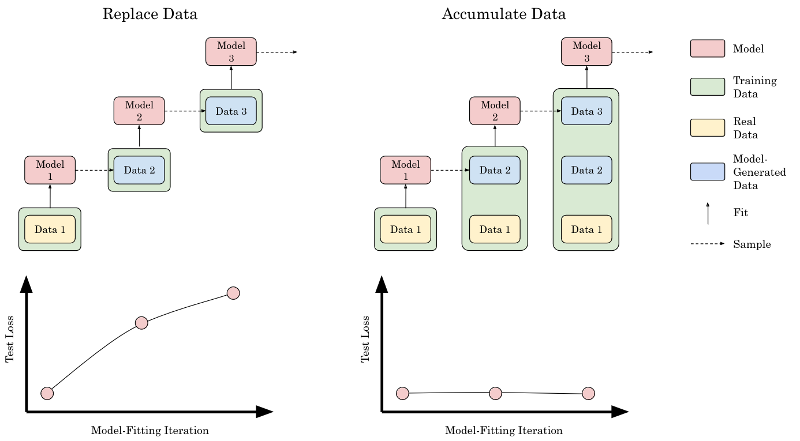
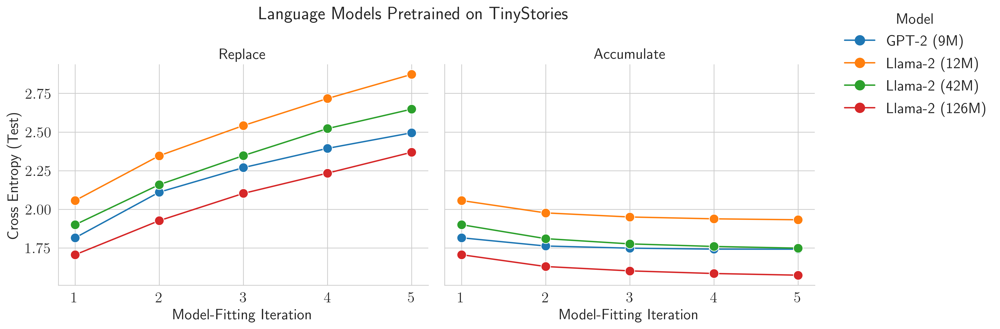
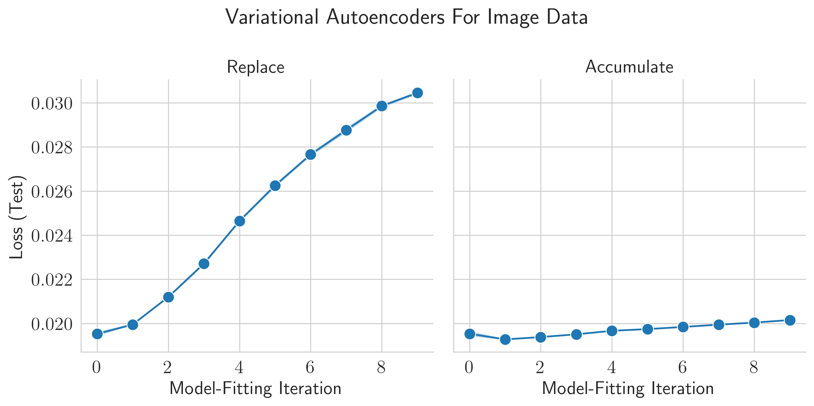
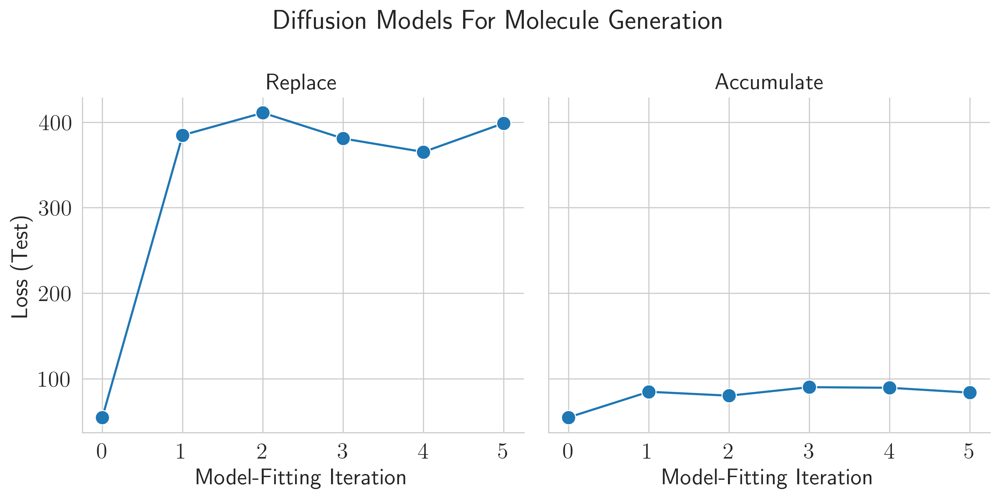
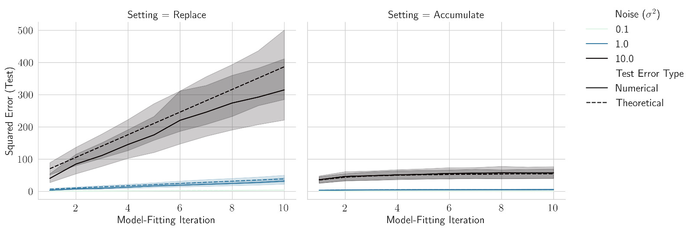
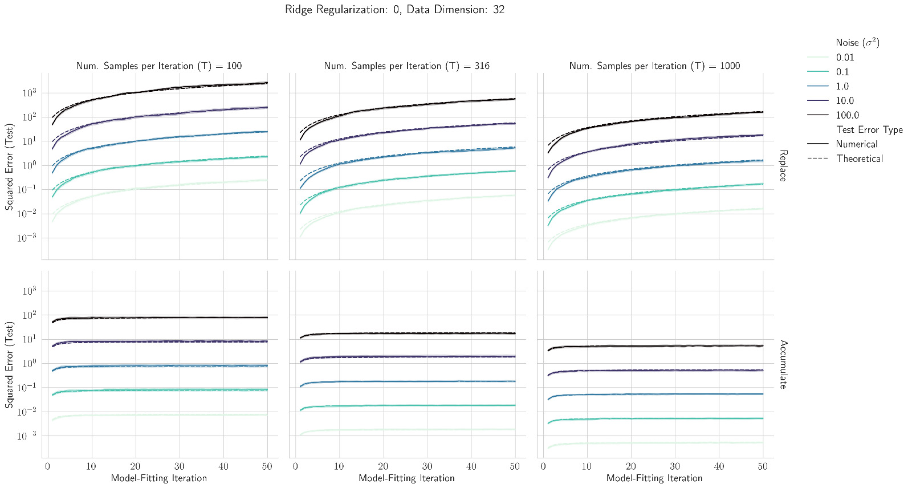

# Is Model Collapse Inevitable? Breaking the Curse of Recursion by Accumulating Real and Synthetic Data

Authors: Matthias Gerstgrasser$$^1$$, Rylan Schaeffer$$^1$$, Apratim Dey$$^1$$, Rafael Rafailov$$^1$$, Tomasz Korbak$$^2$$, Rajashree Agrawal$$^2$$, Henry Sleight$$^2$$, John Hughes$$^2$$, Dhruv Pai, Andrey Gromov, Daniel A. Roberts, Diyi Yang, David L. Donoho, Sanmi Koyejo.

- $$\cdot^{1}$$ denotes co-first authorship.
- $$\cdot^{2}$$ denotes equal contribution.

Venue: Arxiv 2024

## Quick Links

- [Paper](paper.pdf)
- Poster
- [Tweeprint]()

## Summary

What happens when generative models are trained on their own outputs?

Prior works foretold of a catastrophic feedback loop, a curse of recursion, of models descending into madness as they consume their own outputs. Is democratizing access to models poisoning the very data necessary to train future models?

1/N

Excited to announce our newest preprint!

Is Model Collapse Inevitable? Breaking the Curse of
Recursion by Accumulating Real and Synthetic Data

w/ @MGerstgrasser @ApratimDey2 @rm_rafailov @sanmikoyejo @danintheory @Andr3yGR @Diyi_Yang David Donoho

https://arxiv.org/abs/2404.01413

2/N

Many prior works consider training models solely on data generated by the preceding model i.e. data are *replaced* at each model-fitting iteration. This leads to collapse, but may not be realistic in practice.

What happens if data instead accumulate across each iteration?

3/N

We pretrain sequences of transformer-based language models on TinyStories by @EldanRonen & Yuanzhi Li. If data are replaced at each
model-fitting iteration, collapse! But if data accumulate, model collapse is avoided!

4/N

The same results qualitatively hold for VAEs trained on images and diffusion models trained on molecular conformation generation.
Replacing data leads to collapse, but accumulating data avoids collapse!

5/N

Why does this happen? We turn to an analytically tractable setting: sequences of linear models. Previous work by @dohmatobelvis @feeelix_feng & Julia Kempe showed if data are replaced at each iteration, test loss climbs linearly.

6/N

We extend their analysis to show that if data accumulate, the test loss is upper bounded by a small constant!
Replacing data leads to collapse, but accumulating data avoids collapse, even in this toy setting!

7/N

Our results suggest that model collapse may be avoided in a pessimistic hypothetical future where synthetic data are uncontrollably dumped on the internet to be vacuumed up for training the next iteration of generative models.

Borat Gif

8/N

This was such a fun collaboration w/ @___rajashree___ @tomekkorbak @sleight_henry @McHughes288 @dhruv31415

Work done at @stai_research @StanfordAILab @AIatMeta @MIT @sequoia w/ 🙏🙏🙏 to @StanfordData @OpenAI Superalignment @NSF @SloanFoundation @GoogleAI

9/N