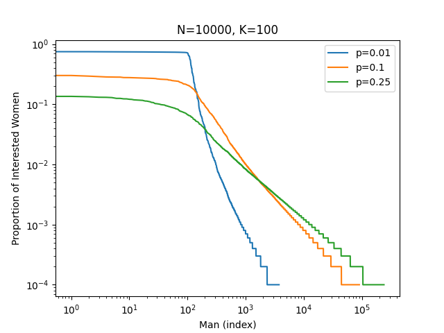

# Why Online Dating is (Almost Certainly) a Waste of Your Time

A few weeks ago, I went on a hike with two friends (6 feet apart, wearing masks,
of course). One of my friends complained that online dating was rough for her,
which surprised me. She's smart, fit, attractive and has a great job, so I asked
what the challenges were. Finding matches was straightforward. Getting
the men to continue investing time after two or three dates was the sticking point.

I think I understand why this is, and the answer points towards one conclusion:
if you're a man less attractive than Adonis, or if you're a woman looking for a
committed relationship, online dating is a poor use of your time.

An easy way to see this is to consider the following (tremendously simplified)
model. Suppose we have $$N$$ men and $$N$$ women all trying to find an opposite-gender
partner. We assume men are interested in all women, but women use a budget constraint
approach: each woman will only select $$K$$ men to express an interest in. We further
assume that women's interests are not independent. Specifically, the probability
that one woman expresses an interest in a man is proportional to the number of other
women expressing an interest in that man, with a parameter $$p \in [0, 1]$$ to capture
the probability of a woman expressing an interest in a new man.

Suppose we order men by the proportion of women interested in that man. What does such
a distribution look like, and why does it tell us that online dating is a waste of
time?

Note the log-log scaling! Turns out $$N$$, the total population of men, doesn't much matter. What matters
is $$K$$, the number of men a woman is willing to consider. The top
$$\approx K$$ men monopolize female interest. The parameter $$p$$, which captures how independent
female preferences are from one another, has a small effect on determining how close
to $$K$$ the final result is; if $$p=0$$, then women all prefer the same men, and exactly
the top $$K$$ men dominate, whereas larger values of $$p$$ push the cliff slightly past $$K$$. The 
independence parameter $$p$$ also controls how steeply female interest in men outside the top
$$K$$ decays. Again, note the log-log scaling!

What's the takeaway? If you're male and not in the top $$K$$, then you will have very few
women interested in you. Online dating is a waste of your time. If you're female, the men who you
express an interest in are overwhelmingly likely to be drowning in matches with other women.
Unless you can offer something truly exceptional, they'll move on. If you want a committed relationship,
online dating is a waste of your time too.